- [Spring Framework](#spring-framework)
  - [Spring](#spring)
        - [什么是Spring框架？它的主要功能是什么？](#什么是spring框架它的主要功能是什么)
        - [Spring的核心模块是哪些？分别介绍它们的作用。](#spring的核心模块是哪些分别介绍它们的作用)
        - [什么是IoC（控制反转）和依赖注入（Dependency Injection）？它们有什么区别？](#什么是ioc控制反转和依赖注入dependency-injection它们有什么区别)
        - [依赖注入的几种方式：](#依赖注入的几种方式)
        - [Spring的Bean是什么？如何定义Bean？Bean的生命周期](#spring的bean是什么如何定义beanbean的生命周期)
        - [Bean的作用域](#bean的作用域)
        - [Spring AOP是什么？它的作用和应用场景是什么？](#spring-aop是什么它的作用和应用场景是什么)
        - [Spring事务管理是如何实现的？介绍Spring事务的传播行为和隔离级别。](#spring事务管理是如何实现的介绍spring事务的传播行为和隔离级别)
  - [Spring MVC](#spring-mvc)
        - [什么是Spring MVC框架？它的主要组件是什么？](#什么是spring-mvc框架它的主要组件是什么)
        - [Spring MVC的请求处理流程是怎样的？](#spring-mvc的请求处理流程是怎样的)
        - [什么是控制器（Controller）？如何定义和使用控制器？](#什么是控制器controller如何定义和使用控制器)
        - [如何处理异常和错误情况？介绍Spring MVC的异常处理机制。](#如何处理异常和错误情况介绍spring-mvc的异常处理机制)
  - [SpringBoot](#springboot)
        - [什么是SpringBoot？它与传统的Spring框架有何不同？](#什么是springboot它与传统的spring框架有何不同)
        - [Spring Boot的核心特点是什么？为什么使用SpringBoot？](#spring-boot的核心特点是什么为什么使用springboot)
        - [如何创建一个SpringBoot应用程序？需要哪些配置和依赖？](#如何创建一个springboot应用程序需要哪些配置和依赖)
        - [介绍@SpringBootApplication注解](#介绍springbootapplication注解)
        - [SpringBoot的自动配置是如何工作的？如何自定义和禁用自动配置？](#springboot的自动配置是如何工作的如何自定义和禁用自动配置)
        - [什么是SpringBoot Starter？如何使用和创建自定义的Starter？](#什么是springboot-starter如何使用和创建自定义的starter)
  - [SpringCloud ALIBABA](#springcloud-alibaba)
    - [Nacos](#nacos)
    - [OpenFeign](#openfeign)
    - [Gateway](#gateway)
    - [Sentinel](#sentinel)
      - [**sentinel常见问题：**](#sentinel常见问题)
    - [分布式事务](#分布式事务)
        - [**2PC**](#2pc)
        - [TCC](#tcc)
        - [**XA方案**](#xa方案)
        - [**Seata-AT**(Automatic Transaction) 二阶段提交](#seata-atautomatic-transaction-二阶段提交)


# Spring Framework

## Spring

##### 什么是Spring框架？它的主要功能是什么？

> Spring是一个开源，轻量级的Java开发框架， Spring和其他单层框架不同，Spring提供一个统一的，高效的方式构造整个应用，并且将这些单层框架组合在一起建立一个连贯的体系。主要是为了使Java EE 开发更加容易；

##### Spring的核心模块是哪些？分别介绍它们的作用。

定期口述；

##### 什么是IoC（控制反转）和依赖注入（Dependency Injection）？它们有什么区别？

> IOC inversion of controller控制反转，它是一种**设计思想**，指将对象的创建的控制权由用户本身交给Spring容器管理；
>
> 将对象的依赖关系交由spring容器管理，并由**IOC容器完成对象的注入**。对象实例通常以`哈希表`的形式存放，其中 Key 和 Value 分别表示对象的标识符和实际的对象实例。
>
> **DI依赖注入是IOC的一种实现方式**，它是指通过外部方式将依赖关系注入到该对象中。

##### 依赖注入的几种方式：

- 构造注入
- set方法注入
- 接口注入（不常用，在接口方法中注入依赖。）

##### Spring的Bean是什么？如何定义Bean？Bean的生命周期

> Bean 代指的就是那些被 IoC 容器所管理的对象。
>
> 可以通过xml配置文件，配置类，注解的方式来定义Bean。
>
> **Bean的生命周期**：
>
> 1. `实例化`: 在这个阶段，Spring容器根据配置或注解等方式示例化一个Bean。实例化的方式可以是通过构造含函数创建一个新的对象，或者通过工厂方法来获取对象示例。
>
> 2. `属性赋值`: 在实例化之后，Spring容器会将配置的属性值或依赖注入到Bean中。这包括设置对象的属性、注入依赖对象和调用相关的初始化方法。
>
> 3. `初始化`：在属性赋值后，Spring容器会调用Bean的初始化方法。
>
> 4. `使用`：在初始化之后，Bean被放置在Spring容器中供应用程序使用。
>
> 5. `销毁`：在应用程序关闭或者手动销毁Bean时，Spring容器会调用Bean的销毁方法。
>
> 

##### Bean的作用域

> `singleton`: 默认的作用域，Spring容器只会创建一个Bean的实例，并且该实例会被**共享和重用**。（且默认是**饿汉式加载**，在Spring启动时就会创建并初始化所有的Bean。可以通过@Lazy将Bean设置为懒加载。）
>
> `prototype`：原型作用域，每次请求都会创建**新的实例bean**。
>
> `application`:在一个Http servlet Context中，定义一个Bean实例。
>
> `request`：每次Http请求会创建新的Bean实例，一次Http请求和响应共享Bean。
>
> `session`：在一个Http session中，定义一个Bean实例，用户会话共享Bean。

##### Spring AOP是什么？它的作用和应用场景是什么？

> AOP为`Aspect Oriented Programming`，面向切面编程；通俗来讲它也是一种编程概念；用于将功能独立，功能解耦，完成切面代码的复用和统一管理；

假设项目很多dao层来查询各种数据，现在需要对这些查询接口做一些日志打印，查询耗时统计。根据aop的思想，将这些功能统一实现，在**编译时增强**或**运行期间代理增强**实现日志打印，查询耗统计等；

aop的底层实现之一是`代理`，由代理结合通知和目标，提供增强功能；代理有静态代理、动态代理；其中动态代理又分为JDK动态代理和CGLIB代理；

另外**Aspectj**也提供了aop的底层实现：

- ajc 通过编译插件对class文件做功能增强；
- agent，aspectjweaver 类加载时可以通过agent修改class实现增强；

备注：Spring AOP 支持XMl和基于 @AspectJ 注解的两种配置方式。AspectJ 注解需要关注一套注解：切面、切点、前置通知、后置通知、环绕通知、异常通知等；

**代理**：

- **静态代理**：静态代理基于接口代理，代理类实现被代理类相同的接口，通过组合的方式完成功能的增强，手动编码且静态代理需要为每个目标类编写一个对应的代理类，因此代码维护和管理相对繁琐。(**编译时**就确定了代理关系)
- **动态代理**：
    - jdk动态代理：动态代理是在**运行时期**根据需要动态生成代理类的代理模式形式。通过Java反射提供的`Proxy`和`InvocationHandler`等API来实现。在运行时生成代理类时，可以在代理类中调用目标对象的方法前后插入额外的逻辑。动态代理可以应用于接口代理和基于类的代理，提供了更灵活的方式来实现AOP。
    - CGLIB动态代理：CGLIB动态代理是基于类的代理方式，它使用字节码技术生成代理类，并通过**继承目标类**来实现代理（*所以final修饰的类不能使用cglib来实现代理*）。CGLIB动态代理使用了第三方库Enhancer来生成代理类。

<font color=red> 总结：在Spring AOP中，当目标对象实现了接口时，Spring会使用JDK动态代理来创建代理对象；当目标对象没有实现接口时，Spring会自动切换到CGLIB动态代理。</font>

##### Spring事务管理是如何实现的？介绍Spring事务的传播行为和隔离级别。

- 编程式事务

```java
@Autowried
private PaltformTransactionManager transactionManager;

public void transaction(){
    TransactionStatus status = transactionManager.getTransaction(new DefaultTransactionDefinition());
    try {
        // 业务逻辑
        transactionManager.commit(status);
    } catch (Exception e) {
        // 回滚
        transactionManager.rollback(status);
    }
}
```

- 声明式事务

`@Transaction`:

**事务失效**：

1. **抛出检查异常导致事务不能正确回滚；**

- why：Spring默认只会回滚非检查异常
- how：配置 rollback 属性 @Transaction(rollbackFor = Exception.class)

2. **业务方法内使用 try-catch 导致事务不能正确回滚**

- why：事务通知只有捕捉到了目标抛出的异常，才能进行后续的回滚处理，如果目标已经在业务层面 try-catch，事务通知无法知悉
- how：catch 块中 抛出异常；
- how: catch 块添加 `TransactionInterceptor.currentTransactionStatus().setRollbackOnly();`

3. **aop 切面顺序导致事务不能正常回滚**

- why: 事务切面优先级最低，如果自定义切面和事务优先级一样，则还是自定义切面在内层，如果内层捕获了异常没有正确抛出异常，则事务也会失效；
- how: 正常抛出，或调整切面顺序；

4. **非public 方法导致事务失效**

- why: Spring 为方法创建代理、添加事务通知，前提条件：该方法是public的；

5. **调用本类方法导致传播行为失效**

- why: 本类方法调用不经过代理，因此无法增强
- how: 依赖注入自己（成为代理）来调用

## Spring MVC

##### 什么是Spring MVC框架？它的主要组件是什么？

> Spring MVC框架主要目标是将应用程序的不同层进行解耦，将应用程序划分为==模型Model==、==视图View==和==控制器Controller==。
>
> - Model：表示应用程序的数据模型，负责封装和处理数据。通常是实体类。
> - View：负责展示数据，并处理交互。通常由JSP、Thymeleaf、Freemaker等模板引擎生成的动态页面。
> - Controller：处理用于请求并协调模型和视图之间的交互。控制器负责接受用户的请求，调用实当的业务逻辑处理请求，并将结果返回。
>
> 主要组件：
>
> - DispatcherServlet:核心中央处理器，负责接受请求、分发、并给予客户端响应。
> - HandlerMapping:负责将请求(url)映射到相应的处理器。比如控制器类中使用@RequestMapping注解来映射请求路径。
> - HandlerAdapter:负责执行具体的处理器方法，将请求的参数绑定到方法的参数中，并处理业务逻辑。例如（addUser方法中的参数）
> - ViewResolver:视图解析器，根据Handler返回的逻辑视图，解析并渲染真正的视图。例如"redirect:/user/list" 逻辑视图重定向到/user/list。再将逻辑视图解析为具体的视图对象。
> - View: Dispatcher把返回的Model传给View（视图渲染）并生成最终的HTMl或其他格式的响应。

##### Spring MVC的请求处理流程是怎样的？

流程见上Spring MVC的主要组件，结合主要组件说。

|  |
| ------------------------------------------------------------ |

##### 什么是控制器（Controller）？如何定义和使用控制器？

> 控制器是处理用户请求并返回响应的组件。控制器负责接受请求、处理业务逻辑、调用相应的服务或dao方法，并最总返回数据或视图给客户端。
>
> 定义和使用控制器：
>
> 1. 定义一个控制器类 UserController;并使用@Controller标记；
> 2. 定义处理接受的请求方法，如getUser，并使用@RequestMapping标记；
> 3. 调用相应的服务，如getUserDao,并最终生成响应并返回，通常是返回一个视图或数据给客户端。

##### 如何处理异常和错误情况？介绍Spring MVC的异常处理机制。

## SpringBoot

##### 什么是SpringBoot？它与传统的Spring框架有何不同？

##### Spring Boot的核心特点是什么？为什么使用SpringBoot？

##### 如何创建一个SpringBoot应用程序？需要哪些配置和依赖？

##### 介绍@SpringBootApplication注解

> @SpringBootApplication是一个组合注解，包含`@SpringBootConfiguration`、`@EnableAutoConfiguration`、`@ComponentScan`；作用分别是
>
> - @SpringBootConfiguration: 也是个组合注解，其包含`@Configuration`(允许在上下文中注册额外的bean或导入其他配置类,@SpringBootConfiguration是要求在整个boot程序中只出现一次；
>
> - @EnableAutoConfiguration: 启用SpringBoot自动装配机制；
>
> - @ComponentScan：扫描该类包所在的包下所有的类；

##### SpringBoot的自动配置是如何工作的？如何自定义和禁用自动配置？

> SpringBoot的自动装配和@SpringBootApplication有很大关系，其包含的`@EnableAutoConfiguration`也是一个组合注解，其包含了`@AutoConfigurationPackage`**用来记住扫描的起始包**和`@Import({AutoConfigurationImportSelector.class})`用来加**载 META-INF/spring.factories 中的自动配置类**。 
>
> @Import也可以直接引入自动装配类，而去读了配置文件完成自动装配是因为：
>
> 1. 让主配置类和自动配置类解耦合，主配置类不应该直到有哪些从属配置；
> 2. `AutoConfigurationImportSelector.class` 实现了 DeferredImportSelector 接口，让自动配置的解析晚于主配置的解析；
>
> 
>
> **禁用自动配置**：@ComponentScan中可以使用excludeFilters排除自动配置类；
>
> **备注**: @ConditionalOnMissingBean 条件注解，该注解会在Spring容器启动时进行条件判断。如果当前Spring上下文中不存在指定类型的Bean，则会创建该Bean到容器中。如果已经存在，则忽略自动配置。

##### 什么是SpringBoot Starter？如何使用和创建自定义的Starter？

> SpringBoot Starter是一种用于简化程序配置和依赖管理的方式，它实际包含了一组相关依赖和配置的模块。像在创建boot应用程序时，我们通常会将当前工程的父模块设置为`spring-boot-starter-parent`，而它的父模块又是`spring-boot-dependencies`，在这个starter中，包含了大量自适应版本的自动配置和依赖。

## SpringCloud ALIBABA

:point_down::point_down::point_down::point_down::point_down::sob:

> 写在前面的话：springcloud的八股和资料目前较少，且我个人接触不到，结合了一些资料和文档，做了一些功能说明和作用，等后面如果有用到再更新。
>
> 其实应该看官网：
>
> [Nacos](https://nacos.io/zh-cn/docs/v2/quickstart/quick-start.html)
>
> [Spring Cloud Gateway](https://docs.spring.io/spring-cloud-gateway/docs/current/reference/html/)
>
> [Sentinel](https://sentinelguard.io/zh-cn/docs/introduction.html)
>
> [Seata](https://seata.io/zh-cn/docs/overview/what-is-seata.html)
>
> [OpenFeign](https://docs.spring.io/spring-cloud-openfeign/docs/current/reference/html/)

### Nacos

**nacos的核心功能**

> nacos 全称`Dynamic Naming and Configuration service` 一个更易于构建云原生应用的动态服务发现、配置管理和服务管理平台。
>
> 提供了三大功能：
>
> - 服务注册与发现：服务提供者将自己的服务实例注册到Nacos中，服务消费者可以通过Nacos获取可用的服务实例列表。
> - 配置管理：Nacos提供了统一的配置管理功能，可以动态管理和推送配置，配置热更新，支持多种数据格式，如properties，yml等。

Nacos的服务注册面板，其中nacos的服务名为boot程序配置文件中spring.application.name；
| 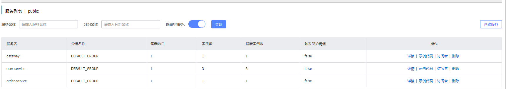 |
| ------------------------------------------------------------ |

Nacos的配置列表面板，其中`Data Id`为**\${prefix服务名}-\${spring.profiles.active环境}.${file-extension后缀}**。根据不同业务场景做好多环节配置隔离Namespace（例如dev，test，prod等），不同业务配置隔离Group。（详见注册表结构）

| 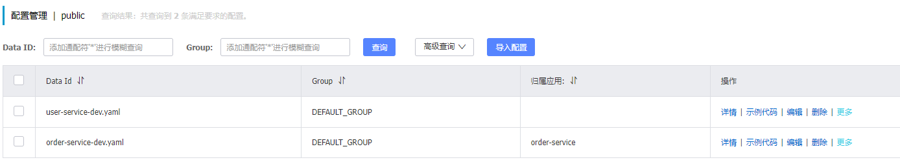 |
| ------------------------------------------------------------ |

**Nacos的配置热更新流程**：

1. 注册配置:配置文件在Nacos中注册；
2. 服务订阅：服务订阅指定的配置，例如订阅符合Data Id的配置；
3. 配置拉取：服务定期从Nacos配置中心拉取配置。（通过与配置中心**建立长连接并监听配置**变化实现的。当配置发生变化时，Nacos会**推送通知**给订阅的服务，服务收到通知发起**配置拉取**。）@RefreshScope/@ConfigurationProperties两者都可以实现配置热更新。
4. 配置更新：服务更新自身的配置；

**配置文件优先级：**{服务名}-{active环境}.{文件名} > {服务名}.{文件名} > 本地配置；

**Nacos数据模型：**Namespace用来隔离环境，Group用来服务分组。一个Service包含多个实例，各个实例可能处于不用地址位置，因为service下有多个集群Cluster，集群下是不同的实例。

<p>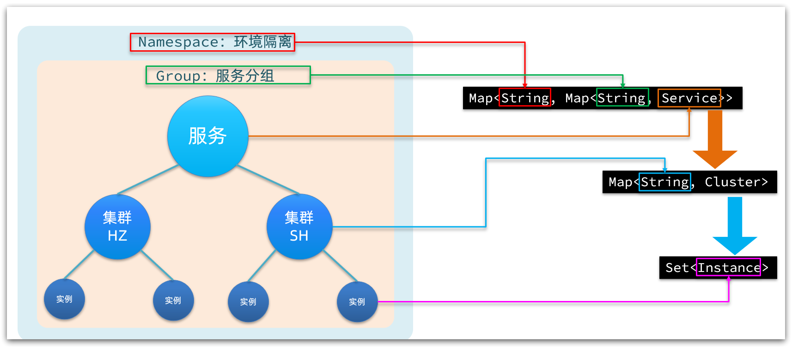</p>

**Nacos中的CAP定理：**

> `Zookeeper`：保证CP，放弃可用性；一旦zookeeper集群中master节点宕了，则会重新选举leader，这个过程可能非常漫长，在这过程中服务不可用。
> 
> `Eureka`：保证AP，放弃一致性；Eureka集群中的各个节点都是平等的，一旦某个节点宕了，其他节点正常服务（一旦客户端发现注册失败，则将会连接集群中其他节点），虽然保证了可用性，但是每个节点的数据可能不是最新的。
> 
> `Nacos`：同时支持CP和AP，默认是AP，可以切换；AP模式下以临时实例注册，CP模式下服务永久实例注册。

#### 高可用

> 高可用的服务注册与发现要围绕`注册服务端崩溃检测`,`客户端检测`和`注册中心选型`三个方面进行。

正常来说，服务器**主动下线**都需要通知注册中心剔除该实例，如果是服务器故障，注册中心怎么判断服务端以及崩溃了，就需要**心跳机制。**如果注册中心和服务端之间的心跳断了，就认为服务端已经崩溃了。但是如果注册中心和服务端之间出现网络抖动，那么心跳也会失败，此时服务并没有崩溃。显然，心跳断了则服务器崩溃的判断不能成立，这是往往需要多发几次心跳来检测。**但是次数越多，心跳间隔越长，注册中心断定服务端已经崩溃的时间就越长。而时间越长，就有越多请求发送给服务端。万一这个时候服务端真的崩溃了，这些请求都会失败。所以这就陷入两难境地了。要么是误以为服务端崩溃，要么是误以为服务端还活着。**

当注册中心发现和服务端的心跳失败了，那么它就应该认为服务端可能已经崩溃了，就立刻通知客户端停止使用该服务端。但是这种失败可能是偶发性的失败，比如说因为网络偶尔不稳定造成的。所以注册中心要继续保持心跳。如果几次心跳都失败了，那么就可以认为服务端已经彻底不可用了。但是如果心跳再次恢复了，那么注册中心就要再次告诉客户端这个服务端是可用的。

实际上，在所有有心跳机制的分布式系统里面判断节点是否崩溃都是一个棘手的问题。比如说心跳失败了要不要继续重试，是立刻重试还是间隔重试，重试的话试几次？

理论上来说，在心跳失败之后如果不进行重试就直接判定服务端崩溃，那么就难以处理偶发性网络不通的问题。而如果要重试，比如说在注册中心和服务端的模型里面，重试三次，而且重试间隔是十秒钟，那么注册中心确定服务端崩溃就需要三十秒。在这三十秒内，客户端估计有成千上万的请求尝试发到崩溃的服务端，结果都失败了。

如果不考虑重试间隔的话，就难以避开偶发性的失败。比如说注册中心和服务端之间网络抖动，那么第一次心跳失败之后，你立刻重试多半也是失败的，因为此时网络很可能还是不稳定。

所以比较好的策略是立刻重试几次，如果都失败了就再间隔一段时间继续重试。所有的重试机制实际上也是要谨慎考虑重试次数和重试间隔的，确保在业务可以接受的范围内重试成功。不过再怎么样，从服务端崩溃到客户端知道，中间总是存在一个时间误差的，这时候就需要客户端来做容错了。

##### **Nacos心跳机制：**

1. **客户端心跳**：
    - 当服务实例启动并接入Nacos注册中心后，作为客户端的服务实例会定期向Nacos服务器发送心跳包。
    - 默认情况下，服务实例每5秒发送一次心跳，该时间间隔可以通过配置进行调整。
    - 心跳包中包含了服务实例的基本信息，如服务ID、实例ID以及健康状态等。
2. **服务端处理心跳**：
    - Nacos服务端接收到心跳包后，会根据心跳内容更新服务实例的状态。
    - 如果服务实例尚未注册，服务端会将其添加到注册列表中。
    - 如果服务实例已经存在于注册列表中，那么心跳包确认了该实例仍处于活跃和健康状态。
3. **健康检查与剔除策略**：
    - **若服务实例连续3次（即默认15秒）未发送心跳，Nacos服务端会将其标记为不健康状态。**
    - 若**服务实例连续6次（即默认30秒）未发送心跳，Nacos服务端会认为该实例已下线或者故障，进而将其从服务注册列表中剔除，不再对外提供服务发现。**
4. **临时实例与持久化实例的区别**：
    - 临时实例遵循上述心跳规则，当心跳超时时会被自动移除，适用于短暂生命周期的服务或无状态服务。
    - 持久化实例（或称永久实例）同样发送心跳以维护健康状态，但即使连续错过心跳也不会被剔除，它们会在注册中心中保持持久存在。

通过这种心跳机制，Nacos能够实时监控各个服务实例的可用性，并基于心跳状态做出相应的服务治理决策，如路由转发、故障剔除等。

##### 客户端容错

> 客户端容错是指**尽量在注册中心或者服务端节点出现问题的时候，依旧保证请求能够发送到正确的服务端节点上**。（客户端容错第一个要考虑的是如果某个服务端节点崩溃了该怎么办。在服务端节点崩溃之后，到注册中心发现，再到客户端收到通知，是存在一段延时的，这个延时是能算出来的。在这段延时内，客户端发送请求给这个服务端节点都会失败。这个延时就是 服务端重新的次数+间隔时间+*注册中心通知客户端该服务器端不可用*，基本上注册中心通知客户端的延时忽略不计，假设重试3次，每次间隔10s，那么也就是说注册中心确定服务端崩溃需要30s ，30s内该客户端发到该服务端成千上万的请求都会失败。）
>
> 一般的策略是客户端在发现调不通之后，应该尝试换另外一个节点进行重试。如果客户端上的服务发现组件或者负载均衡器能够根据调用结果来做一些容错的话，那么它们应该要尝试将这个节点挪出可用节点列表，在短时间内不要再使用这个节点了。后面再考虑将这个节点挪回去。
>
> 客户端的容错其实也牵扯了注册中心的选型，是 AP 还是 CP；

### OpenFeign

> OpenFeign是一个声明式的Web服务客户端，用于简化服务间的Http通信。它解决了如下问题：
>
> 1. 服务间通信的复杂性：各服务之间需要进行大量的HTTP通信，包括参数构件，请求发送，响应解析等。
> 2. 服务调用的维护成本：服务发生变化化，需要重新编码解决调用方代码，而OpenFeign基于接口定义服务调用。
>
> OpenFeign的主要功能包括：
>
> 1. 声明式的服务调用:通过定义接口和使用注解，方便的描述服务之间的关系；
> 2. 内置ribbon负载均衡；可以根据配置的负载均衡策略，自动选择请求转发方式；
>
> OpenFeign访问超时设置：
>
> openFeign默认的超时时间，默认分别是连接超时时间`10秒`、读超时时间`60秒`；注意超时也有可能是Ribbon引起的超时，该连接超时，读超超时默认为1秒；

**Feign 和 openFiegn的区别：**

- Feign是Spring Cloud组件中一个轻量级Restful的HTTP服务客户端，内置了Ribbon，用来做客户端负载均衡，调用注册中心的服务。Feign的使用方式是使用注解定义接口，调用该接口，就可以调用服务器注册中心的服务。
- OpenFeign在Feign的基础上支持了SpringMVC的注解，例如@FiengClient可以解析@RequestMapping注解下的接口。并通过动态代理的方式产生实现类，实现类中做负载均衡并带调用其他服务。

举例：在没有引入openFeign时，consumer对provider发起调用，使用restTemplate发起http请求：

| 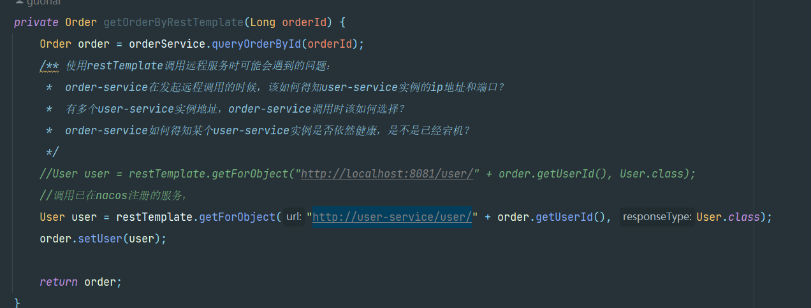 |
| ------------------------------------------------------------ |

而引入了OpenFeign之后，只需要抽取好公共的接口，并引入包，就像调用本地方法一样简单。

| 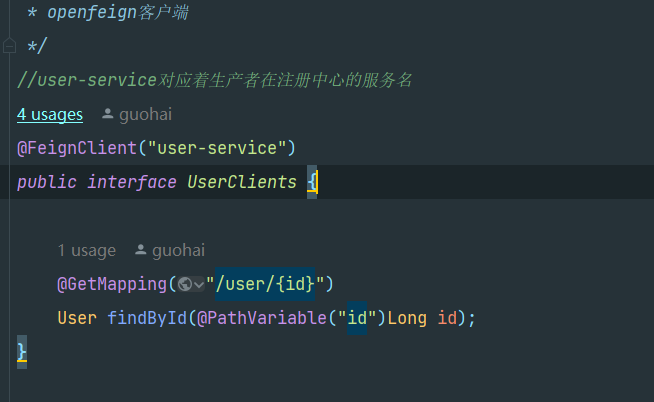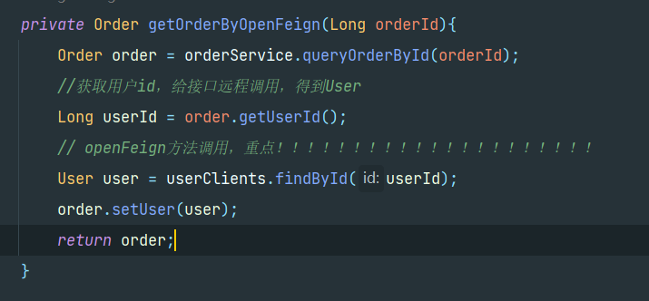 |
| ------------------------------------------------------------ |

**openFign接口传参：**

- 请求体JSON传参 ：@RequestBody

- url路径参数：@PathVariable

- get表单请求参数：`@SpringQueryMap`

    ```java
    @FeignClient("demo")
    public interface DemoTemplate {
    
        @GetMapping(path = "/demo")
        String demoEndpoint(@SpringQueryMap Params params);
    }
    // Params.java
    public class Params {
        private String param1;
        private String param2;
    }
    ```
**openFeign的常见问题：**
- 使用 HttpClient 替换默认的HttpURLConnection，默认的http请求没有连接池，性能和效率都很低。ribbon也是使用的HttpURLConnection，也可替换；
- openFeign和ribbon的超时时间设置；openFeign默认是连接超时10s，读超时60s；Ribbon默认连接超时是1s;

### Gateway

网关功能：

- 身份认证和权限校验
- 服务路由、负载均衡
- 请求限流（通常借助sentinel实现，gateway中是过滤器实现，配置限流规则，例如每秒允许最大的请求数）

`身份认证和权限校验`通常是交给gateway的过滤器链中实现，例如自定义过滤器实现`GlobalFilter `接口；

|  |
| ------------------------------------------------------------ |

 `服务路由、负载均衡`举例:（访问网关url地址时，以/user/开头的请求，都转发给user-service，user-service也是注册在nacos的一个服务）

| 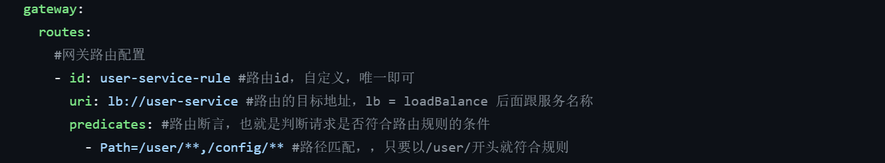 |
| ------------------------------------------------------------ |
### [Sentinel](https://sentinelguard.io/zh-cn/docs/introduction.html)

> 在分布式系统中，各个服务之间依赖关系尤为复杂，如果某服务流量突增，导致服务延迟，响应过慢，随着请求的持续增加，系统可能最后会提供不了服务，如果该服务还和其他服务有依赖关系，那么该问题会慢慢扩散，出现请求堆积、资源占用，慢慢扩散到所有微服务，引起雪崩效应。
>
> 在微服务中，要想使用到sentinel,引入sentinel的依赖，然后在工程的配置文件中，写明sentinel dashboard的地址，开启sentinel的dashboard服务即可使用，所有的请求都会在被访问后成为sentinel的资源；

有下面常见的容错方式保证系统的可用性和稳定性：

1. 主动超时：主动给http请求设置一个超时时间，超时就直接返回。不会造成服务堆积；
2. **限流**：限制最大并发数，QPS等；
3. **熔断**
4. 隔离：把每个依赖或调用的服务都隔离开，防止级联失败引起的整体服务不可用；
5. 降级

> Sentinel是由阿里巴巴开源的轻量级的**流量控制**和**熔断降级**框架，用于保护分布式系统的`稳定性`和`可用性`。它提供了实时的监控、**流量控制**、**熔断降级**、系统保护等功能。

**流量控制阈值:**

- QPS（基于滑动窗口实现）

- 并发线程数

**流控模式**：基于调用关系的流量控制

- 直接：统计当前资源的请求，触发阈值时对当前资源直接限流。

- 关联：关联模式是基于关联的资源（输入关联资源）进行流控，即某个资源的流量受其他关联资源的影响。举例：当前流控规则A关联B，B达到阈值，限流A；

- 链路：记录指定链路上的流量（指定资源从入口资源进来的流量，如果达到阈值，就可以限流该指定链路。）

**流控效果**：

- 快速失败：直接拒绝，当流量超出阈值时，Sentinel直接拒绝，返回Blocked by Sentinel (flow limiting)错误信息；

- Warm up：预热/冷启动方式，让通过的流量缓慢增加，在一定时间内逐渐增加到阈值上限（只针对QPS）；（预热底层时通过`令牌桶`算法）算法中有一个**coldFactor冷却因子**，默认时3，即请求QPS从 threshold(阈值)/3开始，经预热时长逐渐升至设定的QPS阈值；

- 排队等待:排队等待会严格控制请求通过的间隔时间，也是让请求以均匀的速度通过，对应`漏桶算法`（也只针对QPS）。

**熔断降级**：

- `熔断Circuit Breaker`：熔断是一种防止故障扩散的机制，当目标服务出现异常或超过设定的阈值时，熔断器会快速断开该服务的请求，防止继续访问不可用的服务。熔断器通常有三个状态：**关闭状态（允许请求通过）**、**打开状态（拒绝请求）**、**半开状态（部分请求通过）**。
- `降级Fallback`：服务降级指的是服务器压力剧增的情况下，根据当前业务情况及流量对一些服务和页面有策略的降级(提供备用处理逻辑的机制，例如返回缓存，友好的失败信息等)，以此释放服务器资源以保证核心任务的正常运行。

**熔断策略**：

- 慢比例调用（基于响应时间）:根据请求的慢调用比例来触发熔断。当请求的响应时间超过设定的阈值，并且慢调用比例达到设定的阈值时，触发熔断；
- 异常比例：根据请求的异常比例来触发熔断；
- 异常数：根据请求的异常数来触发熔断；

Sentinel分为了两个部分：

1. 核心库Java客户端：不依赖任何框架/库，能够运行于所有Java运行时环境。
2. 控制台Dashboard：基于springboot开发，可直接运行。

**DashBoard面板**：

| 实时监控面板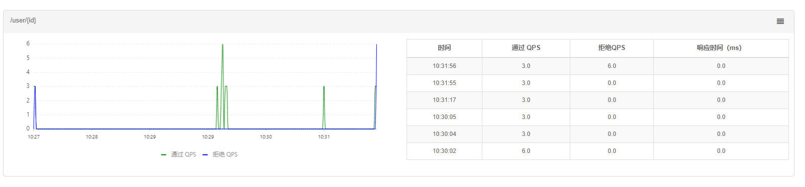 |
| ------------------------------------------------------------ |

|	簇点链路面板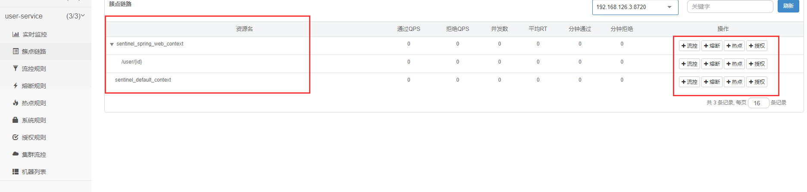	|
| ------------------------------------------------------------ |

**流控规则面板和熔断规则面板**

| 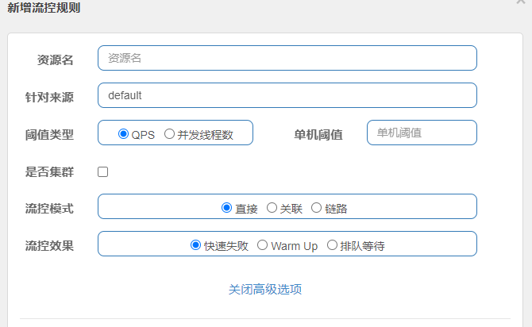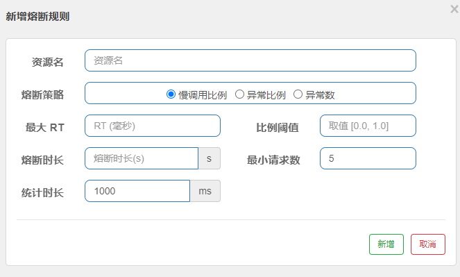 |
| ------------------------------------------------------------ |


| 流控规则面板和熔断规则面板

|  |
| :----------------------------------------------------------- |

#### **sentinel常见问题：**

**限流算法**

- 计数器算法
    - 固定时间窗口
    - 滑动时间窗口

- 漏桶算法
- 令牌桶算法

**四种策略选择**

- 固定窗口：实现简单，但是过于粗暴，除非情况紧急，为了能快速止损眼前的问题可以作为临时应急的方案。
- 滑动窗口：限流算法简单易实现，可以应对有少量突增流量场景。
- 漏桶：对于流量绝对均匀有很强的要求，资源的利用率上不是极致，但其宽进严出模式，保护系统的同时还留有部分余量，是一个通用性方案。
- 令牌桶：系统经常有突增流量，并尽可能的压榨服务的性能。

**单机限流阈值如何计算？**

周期性观察流量图得到真实的QPS峰值，假设该值就是理论水位，进而评估单机限流阈值；

**网关限流后应用层是否还需要限流?**

需要，微服务中，服务往往是错中复杂的，相互调用的，如果仅对网关进行限流，没有对整体服务的一个上下游进行综合分析，可能会限制某些服务的响应以及拖垮某些服务；
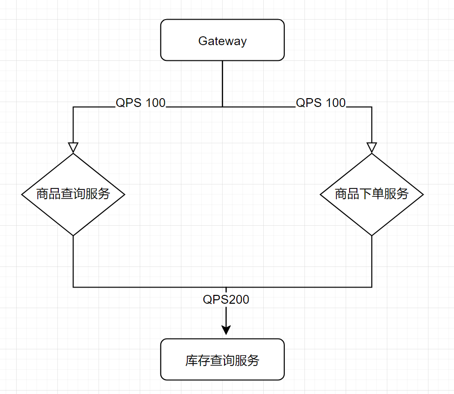

### 分布式事务

> 结合分布式前置知识CAP、BASE和实际的业务再去考虑分布式事务的问题。实现分布式事务的理论已经非常成熟，分布式事务其实就是由多个本地事务组合而成。基本有以下方法：
>
> - 两阶段提交 2PC，强一致性
> - 三阶段提交 3PC，强一致性
> - TCC try confirm cancel 最终一致性
> - 可靠消息 最终一致性
> - 最大努力

- TC 事务协调者 Transaction Coordinator
- TM 事务管理器 Transaction Manager
- RM 资源管理器（事务参与者） Resource Manager

##### **XA协议**

> 2PC的传统方案需要在数据库层面实现，例如MySQL、Oracele等支持2PC，为了统一这个标准，出现了分布式事务处理模型标准 DTP *Distributed transaction processing*；
>
> 模型中定义了三个角色：AP通过TM提交和回滚全局事务，TM向AP提供应用程序编程接口；TM通过XA接口来调用RM进行事务的开始、执行、提交、回滚等数据库操作；
>
> - AP 应用程序
> - RM 资源管理器
> - TM 事务管理器
>
> **DTP模型定义了TM和RM之间通讯的接口规范为 XA，简单来说就是为数据库提供的2PC接口协议，所以基于数据库XA协议实现的2PC一般也被称为XA方案。**
>
> <font color = "red">总结：XA 模式优点为事务强一致性，常用数据库都实现了XA模式，在使用时没有代码侵入。缺点为在一阶段需要锁定数据库资源，等待二阶段结束才释放，降低了并发度，且依赖关系型数据库自己的事务机制。</font>

##### **2PC协议**

> 两阶段提交是一种强一致性设计的协议。引入了一个事务协调者的角色来管理各参与者（本地事务）的提交和回滚，而二阶段分别指的是`准备阶段 prepare`和`提交阶段 commit`。
>
> - 准备阶段：事务协调者TM向所有事务参与者RM发送准备命令（*这个准备命令大概就是除了最后的提交事务之外，其他的所有操作*），并`同步等待所有RM的答复`（同时**各个本地事务也是同步阻塞的，要等待二阶段提交才能结束事务**）；
> - 提交阶段：假如RM都返回成功，那么TM就会向RM发送提交事务的命令，等待所有RM提交成功后，返回事务执行成功。如果准备阶段有RM返回失败，那么TM就会像所有RM发送回滚事务的命令。等待所有事务回滚成功后，返回执行失败；
>
> <font color = "red">总结：2PC是一种尽量保证强一致性的分布式事务，也是**同步阻塞**的，同步阻塞会造成事务变长资源被锁定的问题，且协调者存在**单点故障**的问题；</font>

##### Seata-XA

> Seata 对原始的 XA 方案做了简单的封装和改造，以适应自己的事务模型；
>
> 如图：RM一阶段的流程：
>
> 1. 注册分支事务到TC;
> 2. 执行分支业务sql，但不提交；
> 3. 报告执行状态到TC；
>
> TC 二阶段流程：
>
> 1. TC检查各分支事务执行状态
>     - 成功，通知所有RM提交事务；
>     - 失败，通知所有RM回滚事务；
> 2. RM 二阶段流程：
>     - 接收 TC 指令，提交或回滚事务；

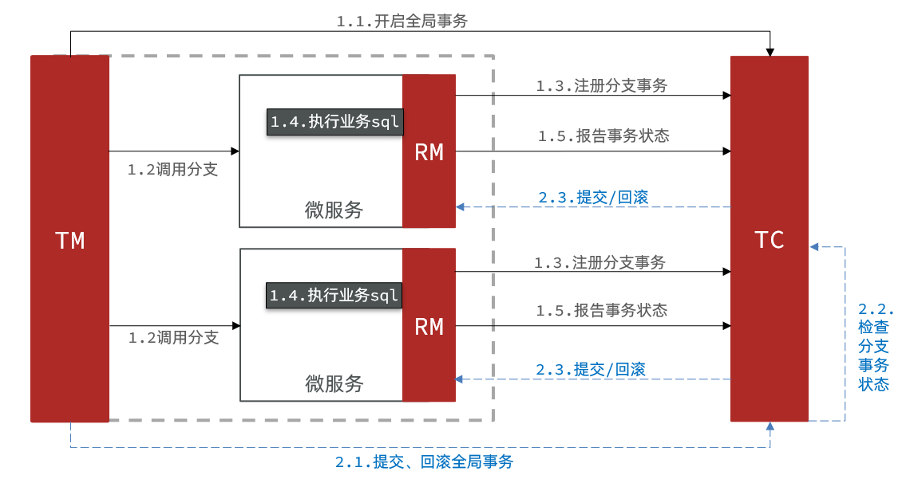

##### **Seata-AT**(Automatic Transaction) 二阶段提交

`AT是二阶段提交协议的一种落地实现`。*应用前提：*基于支持本地ACID事务的关系型数据库+JAVA应用，通过JDBC访问数据库。AT是无侵入的，只需要在TM入口上加上`@GlobalTransation`即可；

**整体机制**

两阶段提交协议的演变：

- 一阶段：**业务数据和回滚日志记录在同一个本地事务中提交，释放本地锁和连接资源。**(对比2PC/XA协议(一阶段不提交事务，锁定资源)优化了同步阻塞，变为直接提交事务)（❗注意这里提交了事务就意味着其他事务可以操作这条数据，可能造成脏写。解决方案为 ：`全局锁和undo log 前后镜像`见官网写隔离方案https://seata.io/zh-cn/docs/dev/mode/at-mode.html）
- 二阶段：
    - 提交异步化，非常快速地完成。
    - 回滚通过一阶段的回滚日志进行反向补偿。

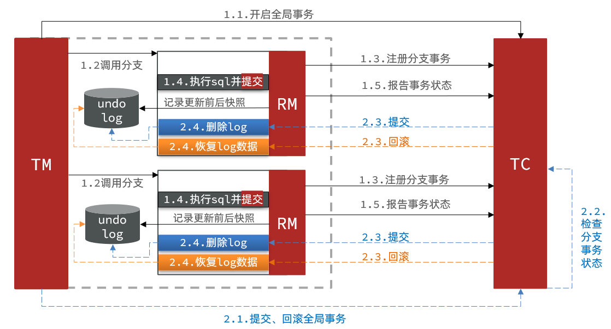


##### TCC

> TCC是一种解决多个微服务之间的分布式事务问题的方案。TCC 模式不依赖于底层数据资源的事务支持，而是在`业务层`做控制；分为三个阶段,并且要求每个事务分支都要实现这三个阶段：
>
> 1. try 预处理，做业务检查和资源预留。（这里通常会结合本地事务表，记录资源预留，全局事务id，事务状态等配合）
> 1. confirm 确认执行业务。try所有分支事务执行成功后，到这里确认真正执行业务。不用做任何业务检查，直接使用try阶段预留的资源来完成业务处理，这个阶段需要满足幂等性，因为会有失败重试，重复执行。
> 1. cancel 取消执行业务，释放try阶段的资源。实现和try相反的操作即为回滚（这里回滚指反向补偿）。这里也需要满足操作的幂等性，因为也会有失败重试会重复执行。
