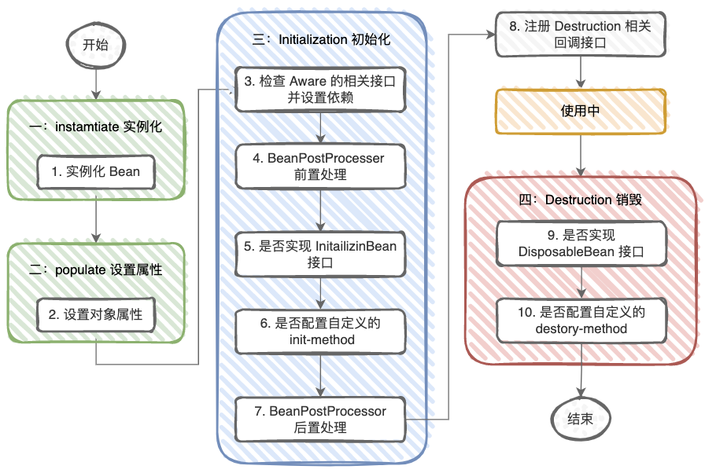
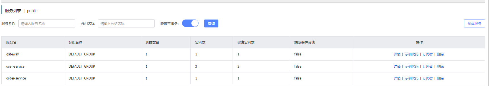
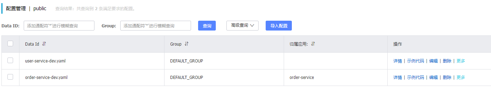
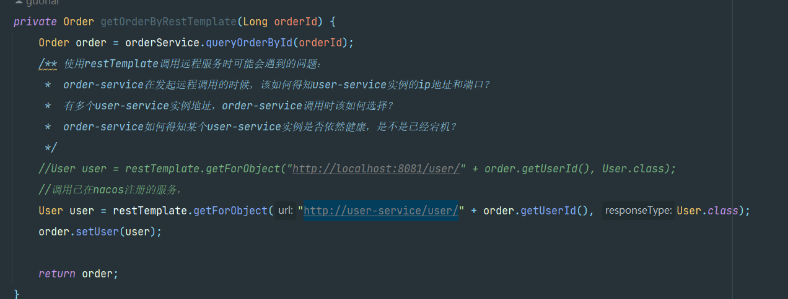
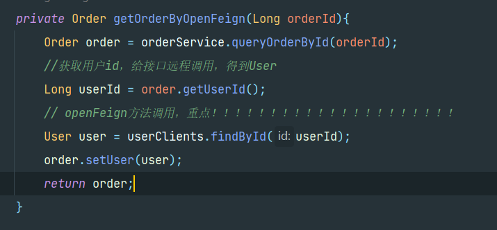
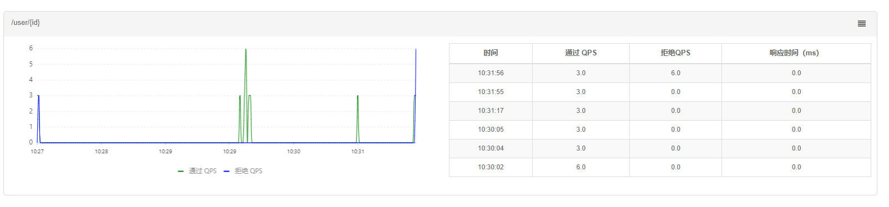
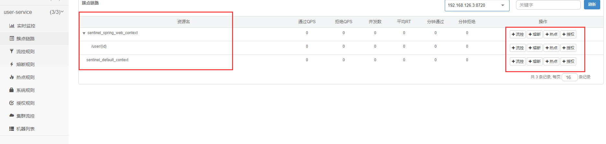
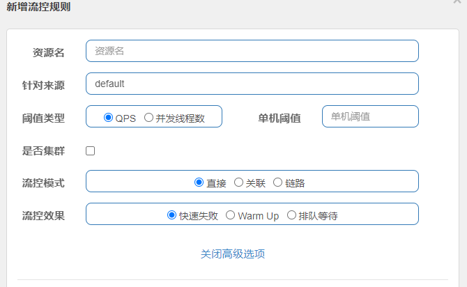
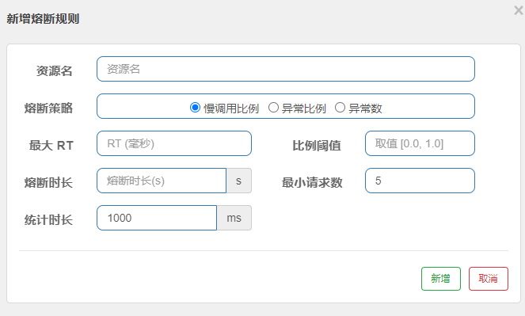

- [Spring Framework](#spring-framework)
  - [Spring](#spring)
    - [什么是Spring框架？它的主要功能是什么？](#什么是spring框架它的主要功能是什么)
    - [Spring的核心模块是哪些？分别介绍它们的作用。](#spring的核心模块是哪些分别介绍它们的作用)
    - [什么是IoC（控制反转）和依赖注入（Dependency Injection）？它们有什么区别？](#什么是ioc控制反转和依赖注入dependency-injection它们有什么区别)
    - [Spring的Bean是什么？如何定义Bean？Bean的生命周期](#spring的bean是什么如何定义beanbean的生命周期)
    - [Bean的作用域](#bean的作用域)
    - [Spring AOP是什么？它的作用和应用场景是什么？](#spring-aop是什么它的作用和应用场景是什么)
    - [Spring事务管理是如何实现的？介绍Spring事务的传播行为和隔离级别。](#spring事务管理是如何实现的介绍spring事务的传播行为和隔离级别)
  - [Spring MVC](#spring-mvc)
    - [什么是Spring MVC框架？它的主要组件是什么？](#什么是spring-mvc框架它的主要组件是什么)
    - [Spring MVC的请求处理流程是怎样的？](#spring-mvc的请求处理流程是怎样的)
    - [什么是控制器（Controller）？如何定义和使用控制器？](#什么是控制器controller如何定义和使用控制器)
    - [如何处理异常和错误情况？介绍Spring MVC的异常处理机制。](#如何处理异常和错误情况介绍spring-mvc的异常处理机制)
  - [SpringBoot](#springboot)
    - [什么是SpringBoot？它与传统的Spring框架有何不同？](#什么是springboot它与传统的spring框架有何不同)
    - [Spring Boot的核心特点是什么？为什么使用SpringBoot？](#spring-boot的核心特点是什么为什么使用springboot)
    - [如何创建一个SpringBoot应用程序？需要哪些配置和依赖？](#如何创建一个springboot应用程序需要哪些配置和依赖)
    - [介绍@SpringBootApplication注解](#介绍springbootapplication注解)
    - [SpringBoot的自动配置是如何工作的？如何自定义和禁用自动配置？](#springboot的自动配置是如何工作的如何自定义和禁用自动配置)
    - [什么是SpringBoot Starter？如何使用和创建自定义的Starter？](#什么是springboot-starter如何使用和创建自定义的starter)
  - [SpringCloud ALIBABA](#springcloud-alibaba)
    - [Nacos](#nacos)
    - [OpenFeign](#openfeign)
    - [Gateway](#gateway)
    - [Sentinel](#sentinel)
    - [Seata分布式事务](#seata分布式事务)

### Spring Framework

#### Spring

##### 什么是Spring框架？它的主要功能是什么？

> Spring是一个开源，轻量级的Java开发框架， Spring和其他单层框架不同，Spring提供一个统一的，高效的方式构造整个应用，并且将这些单层框架组合在一起建立一个连贯的体系。主要是为了使Java EE 开发更加容易；

##### Spring的核心模块是哪些？分别介绍它们的作用。

定期口述；

##### 什么是IoC（控制反转）和依赖注入（Dependency Injection）？它们有什么区别？

> IOC inversion of controller控制反转，它是一种**设计思想**，指将对象的创建的控制权由用户本身交给Spring容器管理；
>
> 将对象的依赖关系交由spring容器管理，并由**IOC容器完成对象的注入**。对象实例通常以`哈希表`的形式存放，其中 Key 和 Value 分别表示对象的标识符和实际的对象实例。
>
> **DI依赖注入是IOC的一种实现方式**，它是指通过外部方式将依赖关系注入到该对象中。

##### Spring的Bean是什么？如何定义Bean？Bean的生命周期

> Bean 代指的就是那些被 IoC 容器所管理的对象。
>
> 可以通过xml配置文件，配置类，注解的方式来定义Bean。
>
> **Bean的生命周期**：
>
> 1. `实例化`: 在这个阶段，Spring容器根据配置或注解等方式示例化一个Bean。实例化的方式可以是通过构造含函数创建一个新的对象，或者通过工厂方法来获取对象示例。
>
> 2. `属性赋值`: 在实例化化之后，Spring容器会将配置的属性值或以来注入到Bean中。这包括设置对象的属性、注入以来对象和调用相关的初始化方法。
>
> 3. `初始化`：在属性赋值后，Spring容器会调用Bean的初始化方法。
>
> 4. `使用`：在初始化之后，Bean被放置在Spring容器中供应用程序使用。
>
> 5. `销毁`：在应用程序关闭或者手动销毁Bean时，Spring容器会调用Bean的销毁方法。
>
> 

##### Bean的作用域

> `singleton`: 默认的作用域，Spring容器只会创建一个Bean的实例，并且该示例会被**共享和重用**。（且默认是**饿汉式加载**，再Spring启动时就会创建并初始化所有的Bean。可以通过@Lazy将Bean设置为懒加载。）
>
> `prototype`：原型作用域，每次请求都会创建**新的实例bean**。
>
> `application`:在一个Http servlet Context中，定义一个Bean实例。
>
> `request`：每次Http请求会创建新的Bean实例，一次Http请求和响应共享Bean。
>
> `session`：在一个Http session中，定义一个Bean实例，用户会话共享Bean。

##### Spring AOP是什么？它的作用和应用场景是什么？

> AOP为`Aspect Oriented Programming`，面向切面编程；通俗来讲它也是一种编程概念；用于将功能独立，功能解耦，完成切面代码的复用和同一管理；

假设项目现在有很多dao层来查询各种数据，现在需要对这些查询接口做一些日志打印，查询耗时统计。根据aop的思想，将这些功能统一实现，在**编译增强**或**运行期间代理**实现日志打印，查询耗统计等；

aop的底层实现之一是`代理`，由代理结合通知和目标，提供增强功能；代理有静态代理、动态代理；其中动态代理又分为JDK动态代理和CGLIB代理；

另外**Aspectj**也提供了aop的底层实现：

- ajc 通过编译插件对class文件做功能增强；
- agent，aspectjweaver 类加载时可以通过agent修改class实现增强；

备注：Spring AOP 支持XMl和基于 @AspectJ 注解的两种配置方式。AspectJ 注解需要关注一套注解：切面、切点、前置通知、后置通知、环绕通知、异常通知等；

**代理**：

- **静态代理**：静态代理基于接口代理，代理类实现被代理类相同的接口，通过组合的方式完成功能的增强，手动编码且静态代理需要为每个目标类编写一个对应的代理类，因此代码维护和管理相对繁琐。(**编译时**就确定了代理关系)
- **动态代理**：
    - jdk动态代理：动态代理是在**运行时期**根据需要动态生成代理类的代理模式形式。通过Java反射提供的`Proxy`和`InvocationHandler`等API来实现。在运行时生成代理类时，可以在代理类中调用目标对象的方法前后插入额外的逻辑。动态代理可以应用于接口代理和基于类的代理，提供了更灵活的方式来实现AOP。
    - CGLIB动态代理：CGLIB动态代理是基于类的代理方式，它使用字节码技术生成代理类，并通过**继承目标类**来实现代理（*所以final修饰的类不能使用cglib来实现代理*）。CGLIB动态代理使用了第三方库Enhancer来生成代理类。

总结：在Spring AOP中，当目标对象实现了接口时，Spring会使用JDK动态代理来创建代理对象；当目标对象没有实现接口时，Spring会自动切换到CGLIB动态代理。

##### Spring事务管理是如何实现的？介绍Spring事务的传播行为和隔离级别。

#### Spring MVC

##### 什么是Spring MVC框架？它的主要组件是什么？

> Spring MVC框架主要目标是将应用程序的不同层进行解耦，将应用程序划分为==模型Model==、==视图View==和==控制器Controller==。
>
> - Model：表示应用程序的数据模型，负责封装和处理数据。通常是实体类。
> - View：负责展示数据，并处理交互。通常由JSP、Thymeleaf、Freemaker等模板引擎生成的动态页面。
> - Controller：处理用于请求并协调模型和视图之间的交互。控制器负责接受用户的请求，调用实当的业务逻辑处理请求，并将结果返回。
>
> 主要组件：
>
> - DispatcherServlet:核心中央处理器，负责接受请求、分发、并给予客户端响应。
> - HandlerMapping:负责将请求(url)映射到相应的处理器。比如控制器类中使用@RequestMapping注解来映射请求路径。
> - HandlerAdapter:负责执行具体的处理器方法，将请求的参数绑定到方法的参数中，并处理业务逻辑。例如（addUser方法中的参数）
> - ViewResolver:视图解析器，根据Handler返回的逻辑视图，解析并渲染真正的视图。例如"redirect:/user/list" 逻辑视图重定向到/user/list。再将逻辑视图解析为具体的视图对象。
> - View: Dispatcher把返回的Model传给View（视图渲染）并生成最终的HTMl或其他格式的响应。

##### Spring MVC的请求处理流程是怎样的？

流程见上Spring MVC的主要组件，结合主要组件说。

|  |
| ------------------------------------------------------------ |

##### 什么是控制器（Controller）？如何定义和使用控制器？

> 控制器是处理用户请求并返回响应的组件。控制器负责接受请求、处理业务逻辑、调用相应的服务或dao方法，并最总返回数据或视图给客户端。
>
> 定义和使用控制器：
>
> 1. 定义一个控制器类 UserController;并使用@Controller标记；
> 2. 定义处理接受的请求方法，如getUser，并使用@RequestMapping标记；
> 3. 调用相应的服务，如getUserDao,并最终生成响应并返回，通常是返回一个视图或数据给客户端。

##### 如何处理异常和错误情况？介绍Spring MVC的异常处理机制。

#### SpringBoot

##### 什么是SpringBoot？它与传统的Spring框架有何不同？

##### Spring Boot的核心特点是什么？为什么使用SpringBoot？

##### 如何创建一个SpringBoot应用程序？需要哪些配置和依赖？

##### 介绍@SpringBootApplication注解

> @SpringBootApplication是一个组合注解，包含`@SpringBootConfiguration`、`@EnableAutoConfiguration`、`@ComponentScan`；作用分别是
>
> - @SpringBootConfiguration: 也是个组合注解，其包含`@Configuration`(允许在上下文中注册额外的bean或导入其他配置类,@SpringBootConfiguration是要求在整个boot程序中只出现一次；
>
> - @EnableAutoConfiguration: 启用SpringBoot自动装配机制；
>
> - @ComponentScan：扫描该类包所在的包下所有的类；

##### SpringBoot的自动配置是如何工作的？如何自定义和禁用自动配置？

> SpringBoot的自动装配和@SpringBootApplication有很大关系，其包含的`@EnableAutoConfiguration`也是一个组合注解，其包含了`@AutoConfigurationPackage`**用来记住扫描的起始包**和`@Import({AutoConfigurationImportSelector.class})`用来加**载 META-INF/spring.factories 中的自动配置类**。 
>
> @Import也可以直接引入自动装配类，而去读了配置文件完成自动装配是因为：
>
> 1. 让主配置类和自动配置类解耦合，主配置类不应该直到有哪些从属配置；
> 2. `AutoConfigurationImportSelector.class` 实现了 DeferredImportSelector 接口，让自动配置的解析晚于主配置的解析；
>
> 
>
> **禁用自动配置**：@ComponentScan中可以使用excludeFilters排除自动配置类；
>
> **备注**: @ConditionalOnMissingBean 条件注解，该注解会在Spring容器启动时进行条件判断。如果当前Spring上下文中不存在指定类型的Bean，则会创建该Bean到容器中。如果已经存在，则忽略自动配置。

##### 什么是SpringBoot Starter？如何使用和创建自定义的Starter？

> SpringBoot Starter是一种用于简化程序配置和依赖管理的方式，它实际包含了一组相关依赖和配置的模块。像在创建boot应用程序时，我们通常会将当前工程的父模块设置为`spring-boot-starter-parent`，而它的父模块又是`spring-boot-dependencies`，在这个starter中，包含了大量自适应版本的自动配置和依赖。

#### SpringCloud ALIBABA

:point_down::point_down::point_down::point_down::point_down::sob:

> 写在前面的话：springcloud的八股和资料目前较少，且我个人接触不到，结合了一些资料和文档，做了一些功能说明和作用，等后面如果有用到再更新。
>
> 其实应该看官网：
>
> [Nacos](https://nacos.io/zh-cn/docs/v2/quickstart/quick-start.html)
>
> [Spring Cloud Gateway](https://docs.spring.io/spring-cloud-gateway/docs/current/reference/html/)
>
> [Sentinel](https://sentinelguard.io/zh-cn/docs/introduction.html)
>
> [Seata](https://seata.io/zh-cn/docs/overview/what-is-seata.html)
>
> [OpenFeign](https://docs.spring.io/spring-cloud-openfeign/docs/current/reference/html/)

##### Nacos

**nacos的核心功能**

> nacos 全称`Dynamic Naming and Configuration service` 一个更易于构建云原生应用的动态服务发现、配置管理和服务管理平台。
>
> 提供了三大功能：
>
> - 服务注册与发现：服务提供者将自己的服务实例注册到Nacos中，服务消费者可以通过Nacos获取可用的服务实例列表。
> - 配置管理：Nacos提供了统一的配置管理功能，可以动态管理和推送配置，配置热更新，支持多种数据格式，如properties，yml等。

Nacos的服务注册面板，其中nacos的服务名为boot程序配置文件中spring.application.name；
|  |
| ------------------------------------------------------------ |

Nacos的配置列表面板，其中`Data Id`为**${prefix服务名}-${spring.profiles.active环境}.${file-extension后缀}**。根据不同业务场景做好多环节配置隔离Namespace（例如dev，test，prod等），不同业务配置隔离Group。（详见注册表结构）

|  |
| ------------------------------------------------------------ |

**Nacos的配置热更新流程**：

1. 注册配置:配置文件在Nacos中注册；
2. 服务订阅：服务订阅指定的配置，例如订阅符合Data Id的配置；
3. 配置拉取：服务定期从Nacos配置中心拉取配置。（通过与配置中心**建立长连接并监听配置**变化实现的。当配置发生变化时，Nacos会**推送通知**给订阅的服务，服务收到通知发起**配置拉取**。）@RefreshScope/@ConfigurationProperties两者都可以实现配置热更新。
4. 配置更新：服务更新自身的配置；

**配置文件优先级：**{服务名}-{active环境}.{文件名} > {服务名}.{文件名} > 本地配置；

**Nacos数据模型：**Namespace用来隔离环境，Group用来服务分组。一个Service包含多个实例，各个实例可能处于不用地址位置，因为service下有多个集群Cluster，集群下是不同的实例。

##### OpenFeign

> OpenFeign是一个声明式的Web服务客户端，用于简化服务间的Http通信。它解决了如下问题：
>
> 1. 服务间通信的复杂性：各服务之间需要进行大量的HTTP通信，包括参数构件，请求发送，响应解析等。
> 2. 服务调用的维护成本：服务发生变化化，需要重新编码解决调用方代码，而OpenFeign基于接口定义服务调用。
>
> OpenFeign的主要功能包括：
>
> 1. 声明式的服务调用:通过定义接口和使用注解，方便的描述服务之间的关系；
> 2. 内置ribbon负载均衡；可以根据配置的负载均衡策略，自动选择请求转发方式；

举例：在没有引入openFeign时，consumer对provider发起调用，使用restTemplate发起http请求：
|  |
| ------------------------------------------------------------ |

而引入了OpenFeign之后，只需要抽取好公共的接口，并引入包，就像调用本地方法一样简单。

|  |
| ------------------------------------------------------------ |

##### Gateway

网关功能：

- 身份认证和权限校验
- 服务路由、负载均衡
- 请求限流（通常借助sentinel实现，gateway中是过滤器实现，配置限流规则，例如每秒允许最大的请求数）

`身份认证和权限校验`通常是交给gateway的过滤器链中实现，例如自定义过滤器实现`GlobalFilter `接口；

|  |
| ------------------------------------------------------------ |

| `服务路由、负载均衡`举例:（访问网关url地址时，以/user/开头的请求，都转发给user-service，user-service也是注册在nacos的一个服务） |

|  |
| ------------------------------------------------------------ |
##### [Sentinel](https://sentinelguard.io/zh-cn/docs/introduction.html)

> 在分布式系统中，各个服务之间依赖关系尤为复杂，如果某服务流量突增，导致服务延迟，响应过慢，随着请求的持续增加，系统可能最后会提供不了服务，如果该服务还和其他服务有依赖关系，那么该问题会慢慢扩散，出现请求堆积、资源占用，慢慢扩散到所有微服务，引起雪崩效应。
>
> 在微服务中，要想使用到sentinel,引入sentinel的依赖，然后在工程的配置文件中，写明sentinel dashboard的地址，开启sentinel的dashboard服务即可使用，所有的请求都会在被访问后成为sentinel的资源；

有下面常见的容错方式保证系统的可用性和稳定性：

1. 主动超时：主动给http请求设置一个超时时间，超时就直接返回。不会造成服务堆积；
2. 限流：限制最大并发数；
3. 熔断
4. 隔离：把每个依赖或调用的服务都隔离开，防止级联失败引起的整体服务不可用；
5. 降级

> Sentinel是由阿里巴巴开元的轻量级的**流量控制和熔断降级框架**，用于保护分布式系统的`稳定性`和`可用性`。它提供了实时的监控、**流量控制**、**熔断降级**、系统保护等功能。

**流量控制**

**流量阈值**：

- QPS

- 线程数

**流控模式**：

- 直接：直接模式是Sentinel默认的流控模式，并根据预设的阈值限制流量的通过。可以设置每秒通过的请求数、并发线程等限制条件；

- 关联：关联模式是基于关联的资源进行流控，即某个资源的流量收其他关联资源的影响。举例：A关联B，B达到阈值，限流A；

- 链路：记录指定链路上的流量（指定资源从入口资源进来的流量，如果达到阈值，就可以限流。）

**流控效果**：

- 快速失败：直接决绝，当流量超出阈值时，Sentinel直接拒绝，返回Blocked by Sentinel (flow limiting)错误信息；

- Warm up：预热/冷启动方式，让通过的流量缓慢增加，在一定时间内逐渐增加到阈值上限（只针对QPS）；（预热底层时通过`令牌桶`算法）算法中有一个**coldFactor冷却因子**，默认时3，即请求QPS从 threshold(阈值)/3开始，经预热时长逐渐升至设定的QPS阈值；

- 排队等待:排队等待会严格控制请求通过的间隔时间，也是让请求以均匀的速度通过，对应`漏桶算法`（也只针对QPS）。

**熔断降级**：

- `熔断Circuit Breaker`：熔断是一种防止故障扩散的机制，当目标服务出现异常或超过设定的阈值时，熔断器会快速断开该服务的请求，防止继续访问不可用的服务。熔断器通常有三个状态：**关闭状态（允许请求通过）**、**打开状态（拒绝请求）**、**半开状态（部分请求通过）**。
- `降级Fallback`：服务降级指的是服务器压力剧增的情况下，根据当前业务情况及流量对一些服务和页面有策略的降级(提供备用处理逻辑的机制，例如返回缓存，友好的失败信息等)，以此释放服务器资源以保证核心任务的正常运行。

**熔断策略**：

- 慢比例调用:根据请求的慢调用比例来触发熔断。当请求的响应时间超过设定的阈值，并且慢调用比例达到设定的阈值时，触发熔断；
- 异常比例：根据请求的异常比例来触发熔断；
- 异常数：根据请求的异常数来触发熔断；

Sentinel分为了两个部分：

1. 核心库Java客户端：不依赖任何框架/库，能够运行于所有Java运行时环境。
2. 控制台Dashboard：基于springboot开发，可直接运行。

**DashBoard面板**：

| 实时监控面板 |
| ------------------------------------------------------------ |

|	簇点链路面板	|
| ------------------------------------------------------------ |

| 流控规则面板和熔断规则面板  |
| ------------------------------------------------------------ |

##### Seata分布式事务