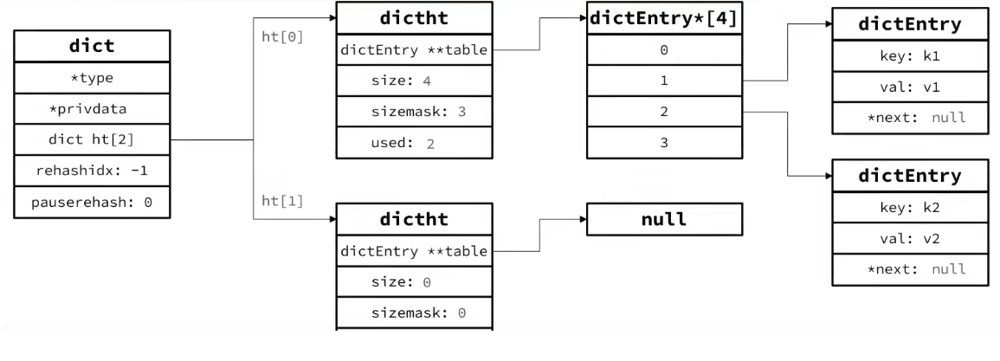

- [redis内存篇](#redis内存篇)
  - [键的过期删除策略和内存淘汰机制](#键的过期删除策略和内存淘汰机制)
- [redis线程模型](#redis线程模型)
  - [网络编程模型](#网络编程模型)
  - [select、poll、epoll简述](#selectpollepoll简述)
- [redis持久化](#redis持久化)
  - [AOF append-only file](#aof-append-only-file)
  - [RDB snapshot](#rdb-snapshot)
  - [aof和rdb的一些对比](#aof和rdb的一些对比)
- [redis高可用](#redis高可用)
  - [主从复制](#主从复制)
  - [Redis Sentinel](#redis-sentinel)
  - [Redis Cluster](#redis-cluster)
- [redis应用](#redis应用)
  - [key设计](#key设计)
  - [缓存更新策略](#缓存更新策略)
  - [并发带来的常见缓存问题](#并发带来的常见缓存问题)
    - [缓存穿透](#缓存穿透)
    - [缓存击穿](#缓存击穿)
    - [缓存雪崩](#缓存雪崩)
- [redis数据类型及实现概括](#redis数据类型及实现概括)
  - [1. String](#1-string)
  - [2. List](#2-list)
  - [3. Hash](#3-hash)
  - [4. Set 集合](#4-set-集合)
  - [5. Sorted Set 有序集合](#5-sorted-set-有序集合)
- [redis数据结构](#redis数据结构)
  - [Dict 哈希表](#dict-哈希表)
    - [Dict的扩容](#dict的扩容)
    - [Dict的收缩](#dict的收缩)
    - [Dict的rehash](#dict的rehash)
  - [ZipList 压缩列表](#ziplist-压缩列表)
    - [优点：](#优点)
    - [**缺点：**](#缺点)
    - [连锁更新问题：](#连锁更新问题)

### redis内存篇

#### 键的过期删除策略和内存淘汰机制

> 在对redis进行数据写时，通常会给key通过`expire`（单位秒）或`pexpire`（单位毫秒）设置一个生存时间`TTL`，在经过指定时间后，*<u>服务器会有相应的机制来删除这个键</u>*, 就得提到redis过期键的删除策略了；

结合redis6中的源码，在 server.h 中 `redisDb`结构体表示着一个redis数据库，`*dict`数据库键空间，保存着数据库中所有键值对。`*expires`过期键字典，键是一个指针，指向键空间中的某个键，过期时间为value;

如何判定一个键是否过期？

1. 检查给定键是否存在于过期字典：如果存在，那么取得键的过期时间；
2. 检查当前时间戳是否大于键的过期时间：如果是的话则表明键过期了；

```c++
typedef struct redisServer {
  	//...
		redisDb *db; 				/* 一个数组指针，保存服务器中的所有数据库（0-15）像select 1 切换到数据库1就是切换数据库 */
  	//...
}redisServer；

typedef struct redisDb {
    dict *dict;                 /* The keyspace for this DB */
    dict *expires;              /* Timeout of keys with a timeout set */
    dict *blocking_keys;        /* Keys with clients waiting for data (BLPOP)*/
    dict *ready_keys;           /* Blocked keys that received a PUSH */
    dict *watched_keys;         /* WATCHED keys for MULTI/EXEC CAS */
    int id;                     /* Database ID */
    long long avg_ttl;          /* Average TTL, just for stats */
    unsigned long expires_cursor; /* Cursor of the active expire cycle. */
    list *defrag_later;         /* List of key names to attempt to defrag one by one, gradually. */
} redisDb;
```

而对于过期的键，redis是需要删除过期键以节约空间，有如下的过期键删除策略（redis采用的是**定期删除+惰性删除**）：

- `惰性删除`: 访问一个过期键时，检查该键是否过期，过期删除；（cpu友好，内存空间不友好）
- `定期删除`: 每隔一段时间，随机检查一些过期键并删除；（cpu不友好，内存空间友好）

虽然提供了对过期键提供了删除策略，但还是有很大可能存在两者策略都漏掉的过期key情况，导致内存空间越来越少，当内存不足时，redis会触发淘汰机制来淘汰这些键，以释放内存空间；列举一些常见的：

- `LRU(least recently used)`：最近最少使用（分为淘汰 <u>所有键</u>和<u>过期键</u>）；
- `LFU(least frequently used)`: 最不经常使用（分为淘汰 <u>所有键</u>和<u>过期键</u>）；
- `ttl`: 先淘汰更早过期的键值；
- `random`： 随机淘汰（分为淘汰 <u>所有键</u>和<u>过期键</u>；

-------


### redis线程模型

> redis是单线程吗？为何单线程还这么快？

​	Redis单线程指的是`使用一个主线程来处理所有的客户端请求和执行命令并响应客户端`这个过程。但 redis 的其他功能，例如持久化、异步删除、集群数据同步等，redis会使用额外的线程来执行。

**redis快的原因：**

1. redis刚刚提到的单线程，避免了==锁的竞争，和线程上下文的切换==带来的额外开销，这是 redis 单线程快的原因之一;
2. ==redis的读写是基于内存的==，内存的读写效率本身就很高且redis有高效的==数据结构==（例如跳表，哈希表等）；
3. ==主线程通过IO多路复用来监听大量客户端的请求连接==，降低了资源消耗；

|  |
| :----------------------------------------------------: |

> 这里介绍IO多路复用技术，它是一种网络编程模型技术；最基础的tcp的socket编程，它是阻塞I/O模型，基本上只能1对1通信，为了服务更多的客户端，比较传统的方式是使用多进程/线程模式，每来一个客户端连接，就分配一个进程/线程。但是当客户端增大到上万个时，切换、调度这些线程又成为了问题，于是就出现了I/O多路复用，可以只在一个进程里处理多个文件的I/O，Linux下提供三种I/O多路复用的API,分别是select、poll、epoll。

#### 网络编程模型

1. **阻塞式**：在这种模型中，程序在发送或接收数据时会阻塞，直到操作完成；
2. **非阻塞式**：即使操作尚未完成，程序也可以发送或接受数据。程序通过轮询来检查操作是否完成，从而实现并发处理（问题：空转，资源浪费）。
3. **I/O多路复用模型**：这种模型使用操作系统提供的机制（如 `select`、`poll` 或 `epoll`）来同时监视多个套接字的状态。它允许程序同时处理多个连接，而无需进行轮询操作。
4. **异步IO模型**：异步模型使用回调函数或事件驱动的方式处理网络操作。程序发送请求后，可以继续执行其他任务，而不必等待响应。当操作完成时，系统会通知程序，触发相应的回调函数。

#### select、poll、epoll简述

1. select实现多路复用的方式是，将已连接socket都放到一个`文件描述符集合`,然后调用select函数将文件描述符集合`拷贝`到内核里。让内核检查是否有网络事件（通过`遍历集合`的方式）产生，当检查到有事件产生后，将此socket标记为可读或可写，再将整个文件描述符集`拷贝`回用户态，然后用户态再遍历的方法找到可读或可写的socket。整个select过程，需要`2次遍历`文件描述符，而且还有发生`2次拷贝`文件描述符集合。而且select使用的文件描述符集合在linux系统中，由内核中的FD_SETSIZE最大值为 `1024`，只能监听 0~1023 个文件描述符。poll 用来存储文件描述符改用了动态数组，以`链表`形式组织，突破了select的文件描述个数限制。
2. epoll在内核里面使用`红黑树`关注进程所有待检测的socket，通过对红黑树的管理，不需要像select/poll在每次操作时都传入整个socket集合，减少了内核和用户空间大量的数据拷贝和内存分配。epoll使用事件驱动的机制，内核里维护了一个`链表`来记录`就绪事件`，只将有事件发生的socket集合传递给应用程序，不需要像select/poll那样轮询扫描整个集合。

### redis持久化

​	redis是基于内存的，与memecached不同的是，redis提供了两种持久化数据的方式，分别为**`AOF`**和**`RDB`**以及在redis6后新出的**`mixed`**，包含AOF和RDB;

​	redis启动redis时，会优先加载aof文件，因为aof里面的文件更完整，如果aof文件不存在，则会去找rdb文件，从rdb文件恢复数据来启动，如果没有rdb文件，则直接启动；

#### AOF append-only file

​	AOF持久化是通过保存redis服务器所执行的`写命令`来记录数据库状态的，由参数appendonly yes/no控制。并且aof追加写由三个参数控制。当aof文件越写越大时，redis提供了aof`重写机制`，当aof文件的大小超过了设定的阈值后，就会启用aof重写机制，来压缩aof文件。AOF 重写机制是在重写时，读取当前数据库中的所有键值对，然后将每一个键值对用一条命令记录到「新的 AOF 文件」，等到全部记录完后，就将新的 AOF 文件替换掉现有的 AOF 文件（重写aof文件也是由子线程完成的，不阻塞主线程）。

```xml
appendfsync everysec 	//默认 每秒将aof_buf缓冲区同步到aof文件中，丢失1秒数据的风险
appendfsync no				//不主动将aof_buf同步到aof文件，交由操作系统决定何时异步的将aof_buf同步到aof文件。也会增加数据丢失的风险
appendfsync always		//在每个redis写入命令后会强制将aof_buf写入aof文件，每个写命令都需要写回硬盘，磁盘io开销大
```

#### RDB snapshot

​	redis将内存中的`快照`通过二进制的形式写入到磁盘文件已到达数据持久化。提供了两个命令来创建rdb文件，`save`和`bgsave`，save 会**阻塞**主线程的操作,直到rdb文件创建完毕。bgsave 是主线程fork一个子线程，通过子线程来创建rdb文件，主线程将继续处理请求命令。

​	在redis配置文件中，提供了三种配置来实现每隔一段时间，自动执行bgsave。

```xml
save 900 1  	//900秒内，至少进行了一次修改，执行bgsave
save 300 10 	//300秒内，至少进行了10次修改，执行bgsave
save 60 10000 //60秒内，至少进行了10000次修改，执行bgsave
```

#### aof和rdb的一些对比

1. redis加载rdb文件恢复数据速度要远快于aof文件；但数据完整度不如aof，aof支持秒级的持久化；
2. rdb文件是二进制的，没有可读性；aof是普通的文本文件；
3. rdb的文件大小要小于aof文件，虽然两者都有一些压缩机制，如rdb会有压缩算法，aof会有bgrewriteaof机制；

### redis高可用

#### 主从复制

> 单机redis存在单点风险。为保证redis的高可用，最简单的方式就是使用`主从复制`扩展redis，主节点 master 主要负责写请求， 从节点 slave 主要负责读请求和来自 master 的请求（redis 是自带读写分离的，可以通过参数`save-read-only yes` 控制slave只读）。`主从复制`就是将一台主节点的数据复制到其他的redis从节点中。尽最大可能保证**主从的数据一致**。**Redis Sentinel 和 Reids Cluster 都依赖于主从复制。**
>
> 通过在从节点配置文件钟加入参数 slaveof/replicaof master'ip port 实现；

**主从复制同步方式：**

- 全量同步：比如第一次同步时，master通过bgsave生成rdb文件，slave接收传输过来`rdb文件`进行同步。
- 增量同步：正常的主从复制过程中，主节点将写的命令发给从节点，从节点执行相同的命令。增量同步是基于`复制缓冲区（Replication buffer）`

#### Redis Sentinel

> redis Sentinel是redis自带的高可用解决方案。它通过监控主节点和自动故障转移来实现高可用。当主节点发生故障时，sentinel会自动选举一个新的主节点进行切换。

**Sentinel作用：**

- **集群监控**：监控所有redis节点（包括sentinel节点自身的状态是否正常）==通过心跳机制检测==。
- **故障转移**：如果一个master出现故障，Sentinel会帮助我们实现故障转移，自动将某一个slave升级为master（经过**选举机制**），确保整个redis的可用性。
- **消息通知**：通知slave新的master连接信息，让他们执行replicaof/slaveof成为新的master的slave;
- **配置中心**：如果故障转移发生了，通知客户端新的master地址。

**Redis Sentinel中有两个下线概念：**

​	**主观下线 sdown：**sentinel节点认为某个redis节点已经下线（通过心跳检测机制，ping没有得到响应pong，响应时间由参数`down-after-milliseconds`控制）。

​	**客观下线 odown：**超过半数的sentinel节点认为某个redis节点已经下线（超过半数参数由`quorum`控制）。

一旦sentinel发现master故障，sentinel需要在slave中选择一个作为新的master，选举依据：

- slave节点与master节点的断开时间长短；
- slave节点的slave-priority优先级，越小优先级越高；
- 最近一次的offset，越大优先级越高；

#### Redis Cluster

> 在主从部署模式上，虽然实现了一定程度的高并发，并保证了高可用，但有如下限制：
>
> - slave数据和master数据一摸一样，master的数据量就是集群的瓶颈限制；
> - redis集群的写能力也受到了master节点的单机限制；

在高版本的redis已经原生支持`集群cluster`模式，可以 多master 多slave 部署，横向扩展Redis集群的能力。


//todo ...................未完


### redis应用

#### key设计


#### 缓存更新策略

> *前提引入：随着业务量的增加，项目的请求量越来越大，每次都是从数据库读取数据的话性能可能会降低，于是将数据库中的数据通过redis放入到内存中，当有请求时，会先看看redis中有没有，如果有则返回。没有则再走数据库。*缓存需要考虑的问题：1. 更新策略； 2. 缓存一致性；

**更新策略**

- 内存淘汰
- 超时剔除
- 主动更新
    - 更新缓存还是删除缓存？(在高并发写缓存的情况下，更新缓存可能会引起**多次的无效缓存写入**，造成性能浪费；而删除缓存当下次查询缓存为空时重建)
    - 先更新数据库还是先删除缓存?（不论是先更新数据库还是先更新缓存，高并发对同一数据进行修改时，都会影响数据的一致性；但先更新数据库再删除缓存更好；因为db的操作慢于内存操作，假设先删除缓存db还未更新，这时候另一个线程进行查询，发现缓存不存在，查到未更新的db数据进行重建，这条缓存就会长期被使用直至缓存过期或被更新，数据不一致的时间更长，几率更高）

#### 并发带来的常见缓存问题

##### 缓存穿透

> 缓存穿透指的是访问**数据库中不存在的数据**，导致没有缓存命中，请求会直接打向数据库，导致数据库负载增加，性能下降，直至崩溃。

常见的解决方案有（业务层面）：

- 缓存null值；
- 布隆过滤器

##### 缓存击穿

> 缓存击穿指的是 **热点key不存在或过期**，在缓存还未及时重建之前，如果此时大量的请求同时打向了数据库，增加了数据库的负载。

常见的解决方案有:

- 加锁，以牺牲吞吐量未代价让单一线程进行数据库访问并重建缓存操作；
- 热点key设置永不过期（不推荐）

##### 缓存雪崩

> 缓存雪崩指的是 **大量缓存在同一时间过期或失效**，如果此时大量的请求无法命中缓存，于是全部请求又访问数据库，造成了数据库的负载，引起一连锁的反应，造成整个系统崩溃。

解决方案：

- 给缓存设置不同的失效时间，避免大量缓存同一时间内失效

**总结：**缓存是一种很经典的设计，以很小的代价来提升系统的性能和效率。开发的方方面面都是用到了缓存，比如MySQl的buffer Pool，redo log 的log buffer等；在上面一些常见的通过业务层面解决一些缓存问题等，redis本身还要做好高可用性，例如使用Redis Cluster等。在整个系统设计层面来说，要做好请求的限流，降级，熔断等保证系统本身的可用性。

### redis数据类型及实现概括

> redis共有5种基本数据结构: String，Hash, Set, Sorted Set, List;

#### 1. String

String类型并没有使用 C语言的字符串，而是由`SDS`实现，SDS 对比c语言原生字符串，具有以下优势：

1. <font color='red'>常数复杂度O(1)获取字符串长度</font>，因为sds内部维护了一个len属性；
2. <font color=red>杜绝了缓冲区溢出</font>，正是由于c字符串不计长度，拼接字符串长度时，可能会造成数溢出，而sds会先检查空间是否足够，不够的话扩展空间；
3. <font color =red>减少修改字符串时带来的内存重分配次数</font>,例如使用`空间预分配`、`惰性释放`两种优化策略；
4. <font color =red>二进制安全</font>，c字符串通过判断空字符串是否到达结尾（字符串中不能包含空格，限制使得c字符串只能保存文本数据），而sds使用len的属性判断字符串是否结束；
5. <font color=red>兼容部分c字符串函数；</font>

#### 2. List

List是一个**双向链表**，是一种有序、可重复的数据结构；Redis的list支持在头部和尾部进行插入、删除和查询操作。

List类型的底层数据结构是由`双向链表或压缩列表`实现：如果元素个数小于512个，且列表每个元素的值都小于64字节，Redis会默认使用压缩列表作为List类型的底层数据结构；如果不满足这个条件，则使用双向链表作为实现；

在Redis3.2版本后，List数据类型的底层数据结构就只由`quicklist`实现，替代了双向链表和压缩列表。(**注意双向链表的缺点，ZipList的缺点**)

- 用法举例：栈、队列、最近联系人、最近文章等；
- 相关命令：`lpush` `lpop`

#### 3. Hash

Hash是一种键值对的无序集合的数据结构。Redis中，Hash用于存储和操作具有key-value的对象的数据结构。Hash允许通过字段来快速查找和访问值。

Hash类型的底层数据结构是由`压缩列表或哈希表`实现；如果哈希类型元素个数小于512个，所有值小于64字节的话，redis会使用压缩列表作为底层数据结构；如果不满足这个条件，则使用哈希表作为实现；

在redis7.0中，压缩列表数据结构以及被废弃了，由`listpack`数据结构实现；

- 用法举例： 存储用户信息、商品信息、对象等；
- 相关命令：`hmset`一次存储对象的多个kv，`hset`修改制定对象的key, `hgetall`获取对象的所有键值对

#### 4. Set 集合

Set类型是一种无序集合，集合中的元素没有先后顺序但都唯一；

Set类型的底层数据结构是由`哈希表或整数集合`实现；如果集合中的元素都是整数且元素个数小于512个，redis会使用整数集合作为Set类型的底层数据结构。不满足这个条件，则使用哈希表作为Set类型的底层数据结构。

- 用法举例：可以基于Set轻易实现交集、并集、差集的操作。这样，就可以非常方便的实现共同关注、共同粉丝等；

- 相关命令：`sadd`向指定集合添加一个或多个元素 `smembers`获取指定集合的所有元素 `sinter key1 key2`获取所有集合的交集 `sunion key1 key2`获取所有集合的并集

#### 5. Sorted Set 有序集合

Soterd Set是一种特殊的集合，其中的每个成员都关联着一个分数score, 并且成员按照分数的大小进行排序。Sorted Set 允许快速地根据成员获取、插入和删除操作，并且支持范围查询和根据分数进行排名。

Sorted Set类型的底层数据结构是由`压缩列表或跳表`实现的；如果有序集合的元素个数小于128个，并且每个元素的值小于64字节时，Redis会使用压缩列表作为底层数据结构；如果不满足这个条件，则使用跳表实现；

在redis7.0中，压缩列表数据结构以及被废弃了，由`listpack`数据结构实现；

- 用法举例：利用该score可以做排行榜，微信步数排行榜，话题榜等；

- 相关命令：`zrange`从小到大指定排序 `zrevrange`从大到小排序 `zrevrank`指定元素排名

### redis数据结构

#### Dict 哈希表

> redis的键值关系的映射是通过底层数据结构Dict来实现的。Dict由三部分组成：`哈希表dictht`、`哈希节点dictEntry`、`字典Dict`;	

```c
typedef struct dict {
    // dcit类型，内置不同的hash函数
    dictType *type;
    // 私有数据，在做特殊hash运算时用
    void *privatedata;
    // 一个dict包含包含两个哈希表，一个是当前数据，另一个一般为空，rehash时使用
    dictht ht[2]；
    //rehash的进度，-1 表示未经性
    long rehashidx;    
    //rehash是否暂停，1则暂停，0则继续
    int16_t pauserrehash；
}dict
```

```c
typedef struct dictht {
    //哈希表数组
    dictEntry **table;
    //哈希表大小,2^n
    unsigned long size;  
    //哈希表大小掩码，用于计算索引值,sizemask = size - 1，哈希值 & sizemask得到的就是索引值
    unsigned long sizemask;
    //该哈希表已有的节点数量
    unsigned long used;
} dictht;
```

```c
typedef struct dictEntry {
    //键值对中的键
    void *key;
    //联合体，键值对中的值，value为以下任一一个数据类型
    union {
        void *val;
        uint64_t u64;
        int64_t s64;
        double d;
    } v;
    //指向下一个哈希表节点，形成链表
    struct dictEntry *next;
} dictEntry;
```
|  |
| --------------------------------------------------- |

##### Dict的扩容

> Dict中的HashTable就是数组结合单向链表的实现，当集中元素较多时，必会导致哈希冲突过多，链表过长，则查询效率会大大降低；

Dict在每次新增键值对时都会检查**负载因子（LoadFactor = used/size）**, 满足以下两种情况时会触发哈希表扩容：

- 哈希表的LoadFactor>=1，并且服务器没有执行**bgsave**或**bgReWriteAof**等后台进程；
- 哈希表的LoadFactor>5;

##### Dict的收缩

Dict每次删除元素时，也会对负载因子做检查，当**LoadFactory<0.1**时，会做哈希收缩；

##### Dict的rehash

> ​	不管是扩容还是收缩，必定会创建新的哈希表，导致哈希表的size和sizemask发生变化，从而影响key值的查询。因此必须对哈希表中的每一个key重新计算索引，放入新的哈希表，正是dictht ht[2]。这个过程称为**rehash再哈希；** **rehash并不是一次完成大量的数据拷贝，而是分多次迁移。** **渐进式哈希**：在rehash过程中，新增操作，则直接写入ht[1]，查询、修改和删除则会在ht[0]和ht[1]一起查找并执行数据迁移，这样可以确保ht[0]的数据只增不减，随着rehash最终ht[0]为空。

#### ZipList 压缩列表

> ZipList压缩链表是`redis为了节约内存而开发的，它是由连续内存块组成的顺序型数据结构`。
>
> 一个ZipList记录了 `zlbytes`占用内存总字节数、`zltail`尾偏移量（距离起始地址的字节偏移量）、`zllen`entry节点个数、`entry`列表节点、`zlend`压缩链表的尾端，固定值为0xFF;
>
> 压缩列表节点`entry`包含三部分：`prevlen`上一个节点的长度；`encoding` 当前节点的数据类型以及长度；data当前节点的实际数据；
>
> - **prevlen：前一节点的长度，占一个或5个字节**
>     - 如果**前一节点**的长度小于254字节，则采用1个字节来保存这个长度值
>     - 如果**前一节点**的长度大于254字节，则采用5个字节来保存这个长度值，第一个字节为0xfe，后四个字节为真实长度。
>
> - encoding：编码属性，记录data的数据类型及长度，占用1个、2个或5个字节。
>
> 列表的节点之间不是通过next指针（记录两个指针需要16个字节）连接（redis普通链表是通过next和pre指针连接），而是记录上一节点和本节点长度来寻址（prevlen+encoding最小2字节，最大10字节），内存占用较低；

##### 优点：

- 内存紧凑型且节约内存；
- 可以高效的利用cpu缓存

##### **缺点：**

- 不能保存过多的元素，否则查询效率会变低；
- 新增或修改某个元素时，压缩列表占用的内存空间需要重新分配，甚至可能引发`连锁更新的问题`。

##### 连锁更新问题：

假设有N个连续的，长度为250~253字节之间的entry，所以entry的prevlen属性用一个字节即可表示，这时，如果插入一个长度大于等于254字节的新节点到ziplist的表头节点，它后序的节点的prevlen 一个字节就需要更新为5个字节了，而从后续的entry都需要更新（这里假设的是entry节点都为254的临界点）引发连锁更新，导致压缩列表占用的空间需要多次重新分配。

#### SkipList 跳表

> **跳表是在链表的基础上实现了一种多层的有序链表；它将链表的查询效率O(n)改进成了O(logN)；**

#### QuickList

> 每个节点都为ZipList的双端链表

特点：

* 节点采用ZipList，解决了传统链表的内存占用问题
* 控制了ZipList大小，解决连续内存空间申请效率问题
* 中间节点可以压缩，进一步节省了内存

#### 链表总结：

> Ziplist相比双端链表更节省内存空间，适合存储小型数据；Quicklist在保持较小内存空间的同时，同时做到了存储大量的数据。Skiplist是Sorted Sort的数据结构，提升查找效率。
