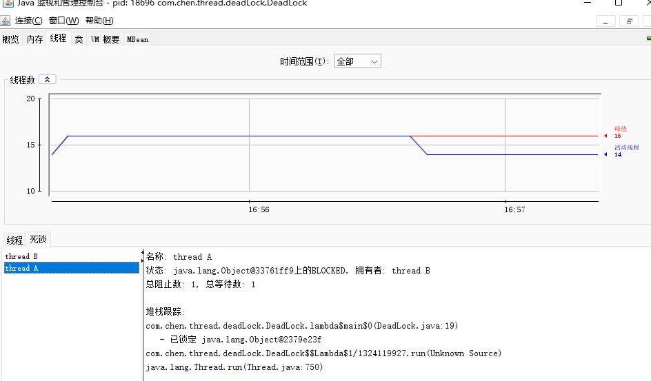

- [线程的状态](#线程的状态)
- [Java创建线程的方式](#java创建线程的方式)
- [Java的一些锁](#java的一些锁)
  - [**ReentrantLock 可重入锁**](#reentrantlock-可重入锁)
  - [**ReentrantReadWriteLock 读写锁**](#reentrantreadwritelock-读写锁)
  - [**StampedLock**](#stampedlock)
  - [Semaphore](#semaphore)
  - [CountDownLatch](#countdownlatch)
  - [CyclicBarrier](#cyclicbarrier)
- [死锁](#死锁)
- [线程池](#线程池)
  - [使用**线程池的优点**：](#使用线程池的优点)
  - [**线程池参数**：](#线程池参数)
  - [处理流程：](#处理流程)
  - [**拒绝策略jdk提供了4中实现**：](#拒绝策略jdk提供了4中实现)
  - [**关闭线程池**](#关闭线程池)
- [Java内存模型](#java内存模型)
- [volatile](#volatile)
- [synchronized](#synchronized)
- [ThreadLocal](#threadlocal)
- [AbstractQueuedSynchronizer](#abstractqueuedsynchronizer)
- [一些线程安全的集合](#一些线程安全的集合)
  - [HashTable](#hashtable)
  - [ConcurrenHashMap](#concurrenhashmap)
  - [CopyOnWriteArrayList](#copyonwritearraylist)

### 线程的状态

> 线程的状态可以结合Java代码中调用什么方法会进行线程状态的切换。例如：`this.wait()`会使得当前线程进行waiting状态。`this.notify()`会唤醒其他线程，使得其他线程进入runnable状态；

1. **new**：创建但还未调用start方法；
2. **runnable**：运行状态，可能在运行，可能在等待操作系统调度；
3. **blocking**：阻塞状态，等待获取锁状态；
4. **waiting**：等待其他线程显示唤醒；
5. **time waiting**：超时等待，可以在指定的时间后自行返回而不是像waiting一直等待；
6. **terminated**：终止状态，表示当前线程已执行完毕。

### Java创建线程的方式

1. 继承Thread类（Thread也是实现了Runnable接口）；
2. 实现Callable接口，重写call方法，带返回值；
3. 实现Runnable接口，重新run方法，没返回值；
4. 通过线程池创建；

### Java的一些锁

#### **ReentrantLock 可重入锁** 

> ReentrantLock与synchronized的对比，两者都是用来实现线程安全的锁工具，都支持重入；
>
> 不同点：
>
> - ReentrantLock是实现了`Lock`接口，内部使用自定义了内部抽象类Sync继承AbstractQueuedSynchronizer实现的锁功能，而synchronized是由jvm层面插入指令`monitorenter`实现；
> - ReentrantLock可通过构造实现公平锁和非公平锁（*默认NonfairSync*）,而synchroinzed只支持非公平锁；
> - ReentrantLock可配合Condition实现条件唤醒，synchronized只能使用notifyAll全部唤醒；

#### **ReentrantReadWriteLock 读写锁**

#### **StampedLock**

> StampedLock提供了三种模式的读写控制模式：读锁、写锁、乐观锁；该锁是jdk8加入，为了进一步优化读性能，它的特点是在使用读锁、写锁时都必须配合*stamp戳*使用。
>
> - 写锁：独占锁，一把锁只能被一个线程获得。会阻塞其他锁的获取，
> - 读锁：在没有线程获取写锁的情况下，多个线程可以同时持有读锁。
> - 乐观读：允许多个线程获取乐观读以及读锁。同时允许一个写线程获取写锁。
>
> stamped.tryOptimisticRead()乐观读，在读取完毕之后需要再做一次`戳验证`，如果校验通过，表示数据安全可以使用，如果校验没有通过，则重新获取读锁，保证数据安全。

#### Semaphore

#### CountDownLatch

#### CyclicBarrier

### 死锁

> 死锁是一种资源竞争的情况，其中每个进程都在等待其他进程释放资源。导致进程无法继续执行，造成资源浪费、性能下降直至系统崩溃；

代码显示：

```java
public class DeadLock {
    public static final Object lockF = new Object();
    public static final Object lockS = new Object();
    public static void main(String[] args) {
        new Thread(() -> {
            synchronized (lockF) {
                try {
                    System.out.println(Thread.currentThread().getName() + "\t持有lockF,等待lockS");
                    TimeUnit.SECONDS.sleep(2);
                    synchronized (lockS) {
                        System.out.println("lockS in");
                    }
                } catch (InterruptedException e) {
                    throw new RuntimeException(e);
                }
            }
        }, "thread A").start();

        new Thread(() -> {
            synchronized (lockS) {
                try {
                    System.out.println(Thread.currentThread().getName() + "\t持有lockS,等待lockF");
                    TimeUnit.SECONDS.sleep(2);
                    synchronized (lockF) {
                        System.out.println("lockS in");
                    }
                } catch (InterruptedException e) {
                    throw new RuntimeException(e);
                }
            }
        }, "thread B").start();
    }
}
```

死锁检测工具：例如使用到了jdk自带工具：`jconsole.exe`：

|  |
| ------------------------------------------------------------ |

**死锁发生条件：**（参考自操作系统）

1. 互斥条件：同一时刻，该资源只能由一个线程占有；
2. 占有和等待条件：已经得到某个资源的线程正在等待获取一个被其他线程持有的资源；
3. 不可抢占条件：已经分配的资源不能从相应的线程中被强制剥夺；
4. 环路等待条件：两者线程相互持有对方的资源并等待对方的资源；

### 线程池

#### 使用**线程池的优点**：

1. 降低资源消耗：池化技术，重复利用已创建的线程；

2. 提高响应速度：不需要等线程创建再执行；

3. 提高线程的可管理性：使用线程池可以统一分配、调优和监控。

#### **线程池参数**：

- **corePoolSize 核心线程数**
- **maxmiumPoolSize 最大线程数**(针对max-core)
- keepAliveTime 线程存活时间
- unit 存活时间单位
- **handler 拒绝策略**
- threadFactory 线程工厂名字
- **workQueue 阻塞队列**

#### 处理流程：

> 当向线程池中提交一个任务时，线程池中的处理流程：
>
> 1. 线程池判断当前运行的线程数是否小于 < corePoolSize,如果小于，则创建线程执行任务，如果都在执行任务，则执行下一阶段；
> 2. 判断工作队列是否已满，如果工作队列没有满，则将该任务队列放入工作队列中，如果工作队列满了，则进行下一阶段；
> 3. 判断线程池是否已满，如果没有满，则创建一个新的线程来执行当前任务，在执行完该任务后，会反复从工作队列中获取任务来执行；
> 4. 如果线程达到maxmiumPoolSize，仍然有新任务这时会执行拒绝策略。

#### **拒绝策略jdk提供了4中实现**：

- `AbortPolicy` 默认策略，让调用者抛出 RejectedExecutionException(*拒绝执行异常*);
- `CallerRunPolicy` 让调用者运行任务；
- `DiscardPolicy` 放弃本次任务；
- `DiscardOledstPolicy` 放弃队列中最早任务，当前任务取而代之；

#### **关闭线程池**

- `shutdown`：将线程池状态变为shutdown，不会接受新任务，但是已提交的任务会执行完，且不会阻塞调用线程的执行；
- `shutdownNow`：将线程池状态变为stop，不会接受新任务，会将队列中的任务返回，并使用interrupt的方式中断正在执行的任务；

### Java内存模型

> JMM定义了Java程序在多线程环境下内存访问规则和行为保证。它规定了线程如何与主存和工作内存进行交互，以及如何确保多线程程序的可见性、有序性和一致性。
>
> Java内存模型主要包含的几个重要概念
>
> 1. 主内存：主内存是所有线程共享的内存区域，储存了所有的变量数据。
> 2. 工作内存：每个线程都有自己的工作内存，用于存储变量的副本，线程对变量的读写都是在工作内存中执行的。
> 3. 内存见的交互：线程之间通过主存进行通信，对变量的读写操作都要通过主存来完成。当线程从主存读取变量时，会将变量的副本加载倒自己的工作内存中。当线程写入变量时，会现在工作内存中进行修改，然后再将修改后的值刷新到内存中。
> 4. 内存可见性：JMM保证在不同线程间的变量可见性。一个线程对变量的修改可以被其他线程及时感知，即保证了变量的内存可见性。
> 5. 原子性：Java内存模型保证读取和写入一个变量的原子性。
> 6. 有序性：JMM保证程序的执行顺序与代码的顺序一致性，即保证了指令的有序性。
>
> Java内存模型通过使用同步锁、volatile、synchronized、原子类、并发容器等机制来保证多线程程序的正确性和可靠性。

### volatile

### synchronized

> synchronized实现同步的基础，每一个java对象都可以作为锁；
>
> - 修饰普通方法，锁的是当前实例对象
> - 修饰静态方法，锁的是Class对象；
> - 修饰代码块，锁的是synchronized括号里配置的对象； synchronized(lock);

Jdk1.6之后队synchronized进行了优化（*实际业务中可能没有那么多并发，所以没必要一上来就是重量锁*），引入了偏向锁和轻量级锁；

**锁的升级和膨胀简述：**（集合对象头markdown的锁标记为来看，实际情况太复杂了）

> 1. 初次执行到synchronized时，这时候的锁则是**偏向锁**（*只是在对象头中存储锁偏向的线程ID，下次访问时不需自旋，只需要看一下对象头是否指向当前线程*）;
>     - 偏向锁的撤销：当发生锁竞争时，另一个线程检查对象头是否存储了自己的线程id，如果不是，则自旋替换为自己的线程id，不成功，则会发生撤销偏向锁；
> 2. 线程尝试使用CAS将对象头中的Mark Word替换为指向`锁记录的指针`，成功则当前线程获取锁，如果失败，则自旋获取。轻量级锁的获取主要有两种情况：
>     - 当偏向锁撤销时；
>     - 多个线程竞争偏向锁时；
> 3. 当锁竞争情况严重，自旋（默认10次）获取锁失败时，锁就会膨胀成为重量级锁，其他线程会被阻塞，而不会再去无效的自旋从而消耗CPU。
>     - 重量级锁的解锁通过monitor解锁方式，owner由操作系统调度从EntryList中线程竞争成为新的owner；

### ThreadLocal

先看一下ThreadLocal的代码实现：

```java
public class ThreadLocal<T> {
    static class ThreadLocalMap {
        /**
   		 * key为弱引用
         */
        static class Entry extends WeakReference<ThreadLocal<?>> {
            /** The value associated with this ThreadLocal. */
            Object value;

            Entry(ThreadLocal<?> k, Object v) {
                super(k);
                value = v;
            }
        }
    }
    //get
     public T get() {
        Thread t = Thread.currentThread();
        ThreadLocalMap map = getMap(t);
        if (map != null) {
            ThreadLocalMap.Entry e = map.getEntry(this);
            if (e != null) {
                @SuppressWarnings("unchecked")
                T result = (T)e.value;
                return result;
            }
        }
        return setInitialValue();
    }
```

> ThreadLocal可以实现对`资源对象`的线程隔离，让每个线程各用各的资源对象，避免争用引发的线程安全问题；
>
> ThreadLocal同时实现了线程内的资源共享；
>
> 其原理是，每个线程内有一个ThreadLocalMap类型的成员变量，用来存储资源对象
>
> 1. 调用set方法，就是以ThreadLocal自己作为key，资源对象最为value，放入当前现成的ThreadLocalMap集合中；
> 2. 调用get方法，就是以ThreadLocal自己作为key，到当前线程中查找关联的资源值；
> 3. 调用remove方法，就是以ThreadLocal自己作为key，移除当前线程关联的资源值；

ThreadLocalMap中的key（即ThreadLocal）为何设计为`弱引用`？

1. Thread可能需要长时间运行（如线程池中的线程），如果key不再使用，需要在内存不足GC时释放其占用的内存；
2. 在key被释放后，后续再get，remove，set方法时，也会释放对应值的内存；

### AbstractQueuedSynchronizer

### 一些线程安全的集合

#### HashTable

> 线程安全的HashMap，是从jdk1.0开始出现的，其实现线程安全方式的效率低下，大多方法前都是加个synchronized实现线程安全；

#### ConcurrenHashMap

> jdk1.8之前的实现是segment+数组+链表的结构，每个segment对应一把锁，如果多个线程访问不同的setment，则不会冲突；
>
> jdk1.8开始ConcurrentHashMap每个数组的的头节点作为锁，如果多个线程的头结点不同，则不会冲突；

ArrayList线程安全的有Vector,CopyOnWriteArrayList等；Vector和HashTable一样很重，add，remove等方法上都是加了synchronized；

#### CopyOnWriteArrayList

> 底层实现了`写入时拷贝`思想，增删改操作会将底层数组拷贝一份，更改操作会在新数组上执行，执行完成后再将修改后的数组赋值回去，这时不影响其他线程的**并发读**，**读写分离**;
>
> 缺点：
>
> - 增删改操作时，都是拷贝一份数组，消耗内存，如果原数组内存占用多的情况下，可能导致gc；
