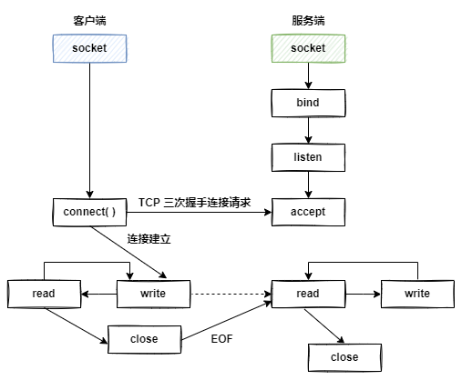

> ​	在客户端发起连接请求前，服务端必须初始化好。服务端首先初始化 socket ，之后服务器需要执行 `bind` 绑定地址和端口函数，紧接着服务端执行 `listen` 函数，将原先的 socket 转化为服务器端的 socket , 最后**阻塞**在 `accept` 上等待客户端请求的到来。
>
> ​	服务器端已经准备就绪。客户端需要先初始化 socket，再执行 connect 向服务器端的地址和端口发起连接请求，这个过程就是 `TCP 三次握手`。
>
> ​	连接一旦建立，数据的传输就不再是单向的，而是双向的，这也是 TCP 的一个特点。

### IO模型

​	操作系统负责计算机的资源管理和进程的调度。应用程序是需要经过操作系统，才能做一些特殊操作，如**磁盘文件读写**、**内存读写**等。操作系统为每个进程都分配了内存空间，这一空间分为`内核空间`和`用户空间`。内核空间是操作系统内核访问的区域，是受保护的内存空间，而用户空间是用户应用程序访问的内存区域。

​	应用程序是跑在用户空间的，它不存在实质的IO过程，真正的IO是在操作系统执行的。即应用程序的IO操作分为：**IO调用**和**IO执行**。<u>IO调用是由进程发起， 而IO执行是操作系统内核的工作。此时所说的IO是应用程序对操作系统IO功能的一次触发，即IO调用。</u>

#### 操作系统的一次IO过程

应用程序发起的一次IO操作包含两个阶段：

- IO调用：应用程序进程向操作系统内核发起调用。
- IO执行：操作系统内核完成IO操作。

操作系统内核完成IO操作还包括两个过程：

- **准备数据**阶段：内核等待 I/O 设备准备好数据
- **拷贝数据**阶段：将数据从内核缓冲区拷贝到用户进程缓冲区

​	其实IO就是把进程的内部数据转移到外部设备，或者把外部设备的数据迁移到进程内部。外部设备一般指硬盘、socket通讯的网卡。一个完整的**IO过程**包括以下几个步骤：

- 应用程序进程向操作系统发起**IO调用请求**
- 操作系统**准备数据**，把IO外部设备的数据，加载到**内核缓冲区**
- 操作系统**拷贝数据**，即将内核缓冲区的数据，拷贝到用户进程缓冲区

#### IO模型

- 阻塞IO

- 非阻塞IO

- IO多路复用

- 信号驱动模型

- 异步IO

##### 阻塞IO

> 阻塞 IO 是在哪里阻塞？
>
> 假设应用程序的进程发起IO调用（read方法），但是如果**内核的数据还没准备好**（包括数据的准备和拷贝[内核空间拷贝到用户空间] ），此时应用程序进程就一直阻塞等待，一直等到内核数据准备好了。此次IO的成为阻塞IO。

##### 非阻塞IO

> 如果内核数据还没准备好，可以先返回错误信息给用户进程，让它无需等待，而是通过轮询的方式再请求。（<u>频繁的轮询会增加CPU的计算资源，造成资源浪费</u>）
>
> **非阻塞IO的非阻塞指的是应用程序进程发起的IO调用非阻塞，内核空间的数据准备和拷贝仍然是阻塞的。**

##### IO多路复用模型

​	非阻塞IO无效的轮询会导致CPU资源的消耗，如果等待内核数据好了，主动通知应用进程再去调用，这不就行了？

​	所以IO多路复用核心思路就是：操作系统内核向用户态提供了一类函数（ 如 select、poll、epoll ），它们可以同时监听多个 `fd` 操作，任何一个 fd  返回数据就绪，应用程序再发起 `recvfrom`  系统调用。

##### select

> select 可以同时监控多个`fd`，在`select`函数监控的`fd`[ *file descriptor文件描述符，Unix中一切皆文件* ]中只要有任何一个数据状态准备就绪，`select`函数就会返回可读状态，这时应用程序进程再发起 `recvfrom` 请求去读取数据。对比非阻塞IO模型，非阻塞需要N( N>= 1) 次轮询系统调用，`select` 的IO多路复用模型，只需要发起一次询问就够了。

select 的缺陷：

1. 监听的IO最大连接有限，Linux系统上为**1024**；（主要是因为进程的文件描述符上限默认是1024，所以在select设计时才把`fd set`设计为1024，改变select数组大小只能重新编译内核）

2. select 函数返回后，是通过遍历 `fd set` 找到就绪的 `fd`。且会发生2次 **`拷贝`  `fd set`**，select 模式会频繁的传递 `fd集合`，频繁的遍历 `fd`;

> select两次拷贝流程：当调用`select`函数之前，`fd_set`需要在用户态创建并初始化，在调用`select`时，这些集合（读/写/异常 fd set）需要被拷贝到内核态，以便内核能对他们检查。在内核态，`select` 函数检查这些文件描述符集合，以确定哪些文件描述符已准备好进行 I/O 操作。一旦 `select` 完成检查，内核将结果填充到你提供的`fd set`中，并将它们从内核态拷贝回用户态。这时通过便利就可以找到就绪的 `fd`。

##### poll

​	poll模式对select做了简单改进，但性能提升不明显。select 模式中的 `fd_set` 大小固定为1024，而`poll_fd`在内核中采用链表，大小理论上无限，这虽然监听 fd 变多了，但每次遍历耗时也上去了。

##### epoll

​	epoll 模式是对 select 和 poll 的改进，实现了事件驱动的网络编程，主要提供了三个函数：`eventpoll()`，它内部包含了

1. 红黑树：记录的是需要监听的 fd。
2. 链表：记录的是已就绪的 fd。

紧接着调用 **`epoll_ctl()`** ，将要监听的`fd` 添加到红黑树上，并且给每个 fd 设置**`监听函数`，**（读/写/异常），调用`epoll_wait()`等待事件的发生， **`epoll_wait()`**将阻塞程序的执行，直到有 `fd` 发生了可读/写/异常事件，一旦有事件发生，`epoll_wait()`就会返回已就绪 `fd 链表` ，不需要像 select/poll 这样遍历整个 fd set。

|  | select                                               | poll                                               | epoll                                                        |
| :------------------------ | :--------------------------------------------------- | :------------------------------------------------- | ------------------------------------------------------------ |
| 底层数据结构		 | 数组                                                 | 链表                                               | 红黑树和双链表                                               |
| 获取就绪的fd 		| 遍历                                                 | 遍历                                               | 事件回调                                                     |
| 事件复杂度  		 | O(n)                                                 | O(n)                                               | O(1)                                                         |
| 最大连接数  		 | 1024                                                 | 无限制                                             | 无限制                                                       |
| fd 拷贝   	| 每次调用select，需要将fd数据从用户空间拷贝到内核空间再拷贝回去 | 每次调用poll，需要将fd数据从用户空间拷贝到内核空间再拷贝回去 | 只在第一次注册 fd 时需要将`fd set`从用户态拷贝到内核态。在后续调用 `epoll_wait` 时，只需要将就绪的`fd 列表`从内核态拷贝回用户态，而不需要再次拷贝`fd set`。 |

**水平触发LT和边缘触发ET**

**水平触发（Level-Triggered）**：

​	水平触发是 `epoll` 默认的工作模式，也是最常见的模式。在水平触发模式下，一旦文件描述符上发生了事件，`epoll` 将不断地通知程序，直到事件被处理。这意味着如果一个文件描述符上有未读数据可用，`epoll` 将不断通知程序可以进行读取操作，哪怕程序不做任何读取操作，`epoll` 会继续通知。

​	水平触发的优点是它相对容易理解和使用，程序可以以常规的方式处理事件。但需要注意的是，如果不在每次通知后正确处理事件，可能会导致资源的浪费，因为 `epoll` 会不断通知已经就绪的文件描述符。

**边缘触发（Edge-Triggered）**：

​	边缘触发是一种更高级的工作模式。在边缘触发模式下，`epoll` 仅在文件描述符上的状态发生变化时才通知程序，而不是在文件描述符上有事件就绪时不断通知。

换句话说，如果一个文件描述符从没有数据变得可读，`epoll` 会通知程序；但如果文件描述符一直可读而程序没有读取数据，`epoll` 不会不断通知。只有在状态发生变化时，才会触发通知。

边缘触发的优点在于它可以减少不必要的通知，因为它只在状态变化时通知，这可以提高性能。但边缘触发模式也更为复杂，因为程序需要确保在每次通知后正确处理事件，否则可能会错过事件。

总结：

- 水平触发模式适用于大多数情况，容易使用和理解，但需要注意不断通知可能导致性能下降。
- 边缘触发模式通常在需要精细控制事件通知的情况下使用，可以提高性能，但需要更小心地处理事件。

select/poll 只有水平触发模式，epoll 默认的触发模式是水平触发；

##### 信号驱动模型

​	信号驱动IO不再用主动询问的方式去确认数据是否就绪，而是向内核发送一个信号（调用 `sigaction`的时候建立一个 `SIGIO`信号）然后应用用户进程**不阻塞**可以去做别的事情。当内核的数据准备好后，再通过`SIGIO`信号通知应用进程，应用进程收到信号后，立即调用`recvfrom`读取数据。

##### 异步IO

​	应用进程进行 `aio_read`系统调用后会立即返回，应用进程继续执行，不会被阻塞，内核态会在所有操作完成之后向应用进程发送信号。异步 io 与信号驱动模型的区别在于，异步 io 的信号是内核通知应用进程 io 操作完成（由内核进行数据的读取并放在用户态指定的缓冲区内），而信号驱动io的信号是通知应用进程可以开始 io 操作。

